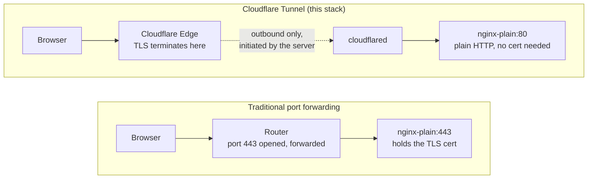

# 03a — Cloudflare Tunnel + DNS

[← Choose Access](03-access.md) | [Home](../setup.md) | [Next: Reverse Proxy →](04-nginx.md)

---

Cloudflare Tunnel creates an outbound connection from your server to Cloudflare's edge. No inbound ports need to be open.

**Traffic flow — compared to traditional port forwarding:**



The router never has an open inbound port in the Tunnel path — `cloudflared` dials out to Cloudflare and holds that connection open; Cloudflare routes matching requests back down it. Cloudflare terminates TLS — no SSL certs needed inside the reverse proxy.

---

## Two ways to run cloudflared

When you create a tunnel, Cloudflare asks which **connector type** you want. That choice determines everything below it — where credentials live and where ingress (hostname → service) is configured.

| | **Docker** (this repo's default) | **Locally-managed** (host install) |
| --- | --- | --- |
| Runs as | `services/cloudflared/` container, managed by `homeserver.py` | A `systemd` service on the host, outside Docker |
| Credentials | One `TUNNEL_TOKEN` from the dashboard | A `<tunnel-id>.json` credentials file, generated by `cloudflared tunnel login` |
| Ingress rules | Configured in the dashboard's **Public Hostname** UI | Configured locally in `~/.cloudflared/config.yml` |
| Auto DNS | Yes — adding a Public Hostname creates the matching CNAME for you | No — you add the CNAME records yourself |
| Stale-tunnel recovery | Yes — `cloudflared-watchdog` companion container (see [`docs/services/cloudflared.md`](services/cloudflared.md)) | Not built in |

**Use Path A (Docker)** unless you have a specific reason to run cloudflared outside this stack (e.g. on a separate box, or a router that runs it natively). Path A is what `services/cloudflared/compose.yml` actually runs; Path B is documented for that case only — don't run both against the same domain, they'll fight over the same hostnames.

---

## Path A — Docker (recommended)

1. Go to the [Cloudflare Zero Trust dashboard](https://one.dash.cloudflare.com) → **Networks → Tunnels → Create a tunnel**.
2. Name it (e.g. `homeserver`), then on the connector step pick **Docker**. Cloudflare shows a sample `docker run` command containing `--token <TOKEN>` — copy just the token value.
3. Set it in the service's env file:
   ```bash
   cp services/cloudflared/.env.example services/cloudflared/.env
   # then set TUNNEL_TOKEN=<value from step 2>
   ```
4. Start it:
   ```bash
   uv run homeserver.py dev up cloudflared
   ```
5. Back in the dashboard, open the tunnel's **Public Hostname** tab and add:

   | Subdomain | Domain | Type | URL |
   | --- | --- | --- | --- |
   | (blank) | yourdomain.com | HTTP | `nginx-plain:80` |
   | www | yourdomain.com | HTTP | `nginx-plain:80` |
   | * | yourdomain.com | HTTP | `nginx-plain:80` |

   **Target `nginx-plain:80` — not `localhost:80`.** `cloudflared` runs in its own container on the `homeserver` Docker network here, so it reaches the reverse proxy by container name, the same way every other service does; `localhost` inside that container isn't the host. Cloudflare auto-creates the DNS CNAME (`<tunnel-id>.cfargotunnel.com`) for each hostname you add here — no separate DNS step needed with this connector type.

That's the full setup for this path. See [`docs/services/cloudflared.md`](services/cloudflared.md) for the `cloudflared-watchdog` companion container and how it recovers from a stale-but-reporting-healthy tunnel.

---

## Path B — Locally-managed (host install)

Only follow this if you deliberately want cloudflared running outside Docker. If you're using this repo's normal setup, use Path A above — skip to the "Service URLs" section further down.

### Install cloudflared

```bash
curl -L https://pkg.cloudflare.com/cloudflare-main.gpg | sudo tee /usr/share/keyrings/cloudflare-main.gpg > /dev/null
echo "deb [signed-by=/usr/share/keyrings/cloudflare-main.gpg] https://pkg.cloudflare.com/cloudflared any main" | sudo tee /etc/apt/sources.list.d/cloudflared.list
sudo apt update && sudo apt install cloudflared
```

### Create tunnel

```bash
cloudflared tunnel login
cloudflared tunnel create homeserver
```

This creates `~/.cloudflared/<tunnel-id>.json`. Note your tunnel ID — you'll need it for the config and DNS.

```bash
# get your tunnel ID
cloudflared tunnel list
```

### Config file

Create `~/.cloudflared/config.yml`:

```yaml
tunnel: <YOUR_TUNNEL_ID>
credentials-file: /home/<user>/.cloudflared/<YOUR_TUNNEL_ID>.json
loglevel: error
no-autoupdate: true
grace-period: 5s

ingress:
  - hostname: "yourdomain.com"
    service: http://localhost:80
  - hostname: "www.yourdomain.com"
    service: http://localhost:80
  - hostname: "*.yourdomain.com"
    service: http://localhost:80
  - service: http_status:404
```

`service: http://localhost:80` is correct here (and only here) — this cloudflared process runs directly on the host, so `localhost:80` reaches nginx-plain's published port the normal way. Don't copy this value into Path A's dashboard config; see the warning there.

### Install as system service

```bash
sudo mkdir -p /etc/cloudflared
sudo cp ~/.cloudflared/config.yml /etc/cloudflared/config.yml
sudo cloudflared service install
sudo systemctl enable cloudflared
sudo systemctl start cloudflared
```

### Set fast stop timeout (optional)

Reduces shutdown wait from 90s to 5s:

```bash
sudo systemctl edit cloudflared
```

Add:

```ini
[Service]
TimeoutStopSec=5
```

```bash
sudo systemctl daemon-reload
sudo systemctl restart cloudflared
```

### DNS records

Path A auto-creates DNS for you (see above) — this section is Path B only. In **Cloudflare Dashboard → DNS**, add these three records. Replace `<tunnel-id>` with your tunnel UUID.

| Type | Name | Target | Proxy |
| --- | --- | --- | --- |
| CNAME | `@` | `<tunnel-id>.cfargotunnel.com` | Proxied |
| CNAME | `www` | `<tunnel-id>.cfargotunnel.com` | Proxied |
| CNAME | `*` | `<tunnel-id>.cfargotunnel.com` | Proxied |

The wildcard `*` covers all subdomains — immich, nextcloud, anything you add later. Don't add per-service records; the reverse proxy handles routing internally.

---

## Service URLs (use these in later steps)

| Service | URL |
| --- | --- |
| Landing | `https://yourdomain.com` |
| Nextcloud | `https://nextcloud.yourdomain.com` |
| Immich | `https://immich.yourdomain.com` |
| Dozzle | `https://dozzle.yourdomain.com` |
| NPM admin (if using NPM) | `http://localhost:81` via SSH tunnel |

---

> After completing your full setup, see [09 — Firewall](09-firewall.md) for production-specific UFW rules and compose port bindings that lock down the server correctly for this path.

---

[← Choose Access](03-access.md) | [Home](../setup.md) | [Next: Reverse Proxy →](04-nginx.md)
