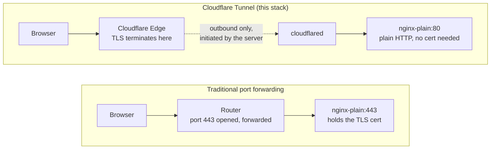

# 03a — Cloudflare Tunnel + DNS

[← Choose Access](03-access.md) | [Home](../setup.md) | [Next: Reverse Proxy →](04-nginx.md)

---

Cloudflare Tunnel creates an outbound connection from your server to Cloudflare's edge. No inbound ports need to be open.

**Traffic flow — compared to traditional port forwarding:**



The router never has an open inbound port in the Tunnel path — `cloudflared` dials out to Cloudflare and holds that connection open; Cloudflare routes matching requests back down it. Cloudflare terminates TLS — no SSL certs needed inside the reverse proxy.

---

## Install cloudflared

```bash
curl -L https://pkg.cloudflare.com/cloudflare-main.gpg | sudo tee /usr/share/keyrings/cloudflare-main.gpg > /dev/null
echo "deb [signed-by=/usr/share/keyrings/cloudflare-main.gpg] https://pkg.cloudflare.com/cloudflared any main" | sudo tee /etc/apt/sources.list.d/cloudflared.list
sudo apt update && sudo apt install cloudflared
```

## Create tunnel

```bash
cloudflared tunnel login
cloudflared tunnel create homeserver
```

This creates `~/.cloudflared/<tunnel-id>.json`. Note your tunnel ID — you'll need it for the config and DNS.

```bash
# get your tunnel ID
cloudflared tunnel list
```

## Config file

Create `~/.cloudflared/config.yml`:

```yaml
tunnel: <YOUR_TUNNEL_ID>
credentials-file: /home/<user>/.cloudflared/<YOUR_TUNNEL_ID>.json
loglevel: error
no-autoupdate: true
grace-period: 5s

ingress:
  - hostname: "yourdomain.com"
    service: http://localhost:80
  - hostname: "www.yourdomain.com"
    service: http://localhost:80
  - hostname: "*.yourdomain.com"
    service: http://localhost:80
  - service: http_status:404
```

All traffic hits the reverse proxy (nginx-plain by default) on port 80, which routes to the correct container by domain name.

## Install as system service

```bash
sudo mkdir -p /etc/cloudflared
sudo cp ~/.cloudflared/config.yml /etc/cloudflared/config.yml
sudo cloudflared service install
sudo systemctl enable cloudflared
sudo systemctl start cloudflared
```

## Set fast stop timeout (optional)

Reduces shutdown wait from 90s to 5s:

```bash
sudo systemctl edit cloudflared
```

Add:

```ini
[Service]
TimeoutStopSec=5
```

```bash
sudo systemctl daemon-reload
sudo systemctl restart cloudflared
```

---

## DNS Records

In **Cloudflare Dashboard → DNS**, add these three records. Replace `<tunnel-id>` with your tunnel UUID.

| Type | Name | Target | Proxy |
| --- | --- | --- | --- |
| CNAME | `@` | `<tunnel-id>.cfargotunnel.com` | Proxied |
| CNAME | `www` | `<tunnel-id>.cfargotunnel.com` | Proxied |
| CNAME | `*` | `<tunnel-id>.cfargotunnel.com` | Proxied |

The wildcard `*` covers all subdomains — immich, nextcloud, anything you add later. Don't add per-service records; the reverse proxy handles routing internally.

---

## Service URLs (use these in later steps)

| Service | URL |
| --- | --- |
| Landing | `https://yourdomain.com` |
| Nextcloud | `https://nextcloud.yourdomain.com` |
| Immich | `https://immich.yourdomain.com` |
| Dozzle | `https://dozzle.yourdomain.com` |
| NPM admin (if using NPM) | `http://localhost:81` via SSH tunnel |

---

> After completing your full setup, see [09 — Firewall](09-firewall.md) for production-specific UFW rules and compose port bindings that lock down the server correctly for this path.

---

[← Choose Access](03-access.md) | [Home](../setup.md) | [Next: Reverse Proxy →](04-nginx.md)
