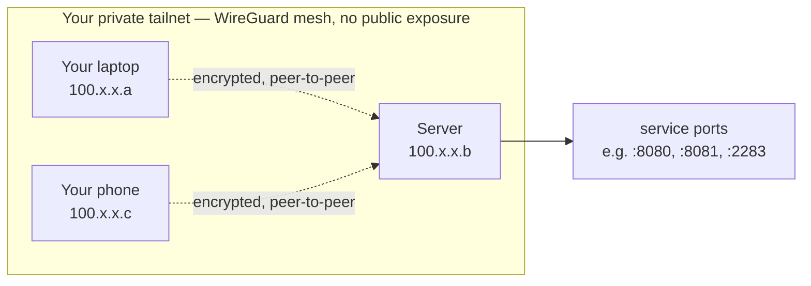

# 03b — Tailscale (Testing)

[← Choose Access](03-access.md) | [Home](../setup.md) | [Next: Reverse Proxy →](04-nginx.md)

---

Tailscale gives every device on your tailnet a private IP. Services are reachable by IP — no domain, no DNS, no open ports. Good for testing before you set up a domain.



Each device reaches the server directly by its Tailscale IP and a service's own dev port — there's no reverse-proxy hop and no TLS, since traffic never leaves the tailnet. Compare to [03a — Cloudflare Tunnel](03a-cloudflare.md)'s path, which is public and TLS-terminated at Cloudflare's edge instead.

---

## Install

```bash
curl -fsSL https://tailscale.com/install.sh | sh
```

## Authenticate

```bash
sudo tailscale up
# visit the URL it prints to authorize the machine
```

## Get your Tailscale IP

```bash
tailscale ip -4
# e.g. 100.x.x.x
```

---

## Service URLs (use these in later steps)

| Service | URL |
| --- | --- |
| Landing | `http://100.x.x.x:8080` |
| Nextcloud | `http://100.x.x.x:8081` |
| Immich | `http://100.x.x.x:2283` |
| Dozzle | `http://100.x.x.x:9999` |
| NPM admin (if using NPM) | `http://100.x.x.x:81` |
| SSH | `ssh user@100.x.x.x` |

> Replace `100.x.x.x` with your actual Tailscale IP everywhere in the remaining steps.

## Family / device access

Each person installs Tailscale on their device and joins your tailnet. They then use the same IP-based URLs above.

- Android / iOS: install the Tailscale app and sign in
- Approve new devices in the Tailscale admin console if you have approval mode on

---

## Limitations vs Cloudflare Tunnel

- HTTP only (no automatic HTTPS)
- Only accessible on the tailnet — not publicly reachable
- Immich mobile app works fine on Tailscale but backup only runs when the device is on the tailnet

When you're ready to go production, follow [03a — Cloudflare Tunnel](03a-cloudflare.md) and update your trusted domains and mobile URLs accordingly.

---

> After completing your full setup, see [09 — Firewall](09-firewall.md) for Tailscale-specific UFW rules that restrict access to your LAN and Tailscale subnet only.

---

[← Choose Access](03-access.md) | [Home](../setup.md) | [Next: Reverse Proxy →](04-nginx.md)
