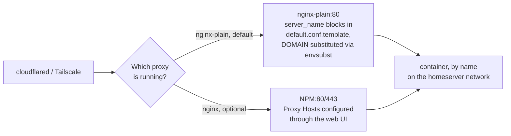

# 04 — Reverse Proxy

[← Access Setup](03-access.md) | [Home](../setup.md) | [Next: Nextcloud →](05-nextcloud.md)

---

Two reverse proxy options — **run only one at a time**, both bind to ports 80/443.

| Option | Service | Best for |
| --- | --- | --- |
| `nginx-plain` | Plain nginx with template config | **Default** — config-file based, domain-templated |
| `nginx` (NPM) | Nginx Proxy Manager | UI-based config, Let's Encrypt via browser |



Both resolve a service the same way underneath (container name on the `homeserver` network) — they differ only in *how* that mapping gets configured: a text template vs. a web UI. Mutually exclusive because both claim ports 80/443.

---

## nginx-plain (default)

Config lives in `nginx-plain/templates/default.conf.template`.
At container start, nginx substitutes `${DOMAIN}` with the value from root `.env`.

```bash
uv run homeserver.py dev up nginx-plain
```

Every service already has a `server_name <service>.${DOMAIN}` block in the template.
To add a new service: edit the template, add a `server` block, then recreate the container:

```bash
uv run homeserver.py dev up nginx-plain
# (docker compose recreates the container, envsubst re-runs)
```

No UI — all config is in the template file.

---

## Nginx Proxy Manager (optional)

UI-based proxy with a web interface for adding proxy hosts and managing Let's Encrypt certs.

```bash
uv run homeserver.py dev up nginx
```

Admin UI:

- **Cloudflare path:** `http://localhost:8181` (or SSH tunnel: `ssh -L 8181:127.0.0.1:8181 user@server`)
- **Tailscale path:** `http://100.x.x.x:8181`

Default login: `admin@example.com` / `changeme` — change immediately.

Go to **Proxy Hosts → Add Proxy Host** for each service.
The Forward Hostname is the Docker **container name** — NPM resolves via the `homeserver` network.

> No SSL certs in NPM when using Cloudflare — Cloudflare handles TLS at the edge.
> Adding certs here causes double-encryption.

→ See [11 — Services Reference](11-services-reference.md) for the full proxy host table.

---

## Real client IP (not cloudflared's own IP)

`services/nginx-plain/templates/default.conf.template` derives a `$real_client_ip` variable and uses it everywhere instead of `$remote_addr`:

```nginx
map $http_cf_connecting_ip $real_client_ip {
    default $http_cf_connecting_ip;
    ''      $remote_addr;
}
```

**Why this exists — confirmed live, not theoretical.** For traffic arriving via Cloudflare Tunnel, `$remote_addr` at nginx-plain is *always* `cloudflared`'s own container IP — nginx only sees the tunnel hop, never the real visitor. Left unfixed, every backend app's `X-Real-IP`/`X-Forwarded-For` headers, and nginx's own access log (which CrowdSec reads for IP-based ban decisions — `crowdsec.enable: "true"` in this compose.yml), all show the same internal Docker IP for every single visitor, regardless of where they actually are. `CF-Connecting-IP` is the header Cloudflare's edge always sets accurately to the real visitor IP, and `cloudflared` preserves it end to end — falls back to `$remote_addr` for direct dev-port access that bypasses Cloudflare entirely (nothing sets `CF-Connecting-IP` in that path).

Every vhost's `proxy_set_header X-Real-IP`/`X-Forwarded-For` uses `$real_client_ip`, and every `server {}` block sets its own `access_log ... cf_combined;` using a log format that's the same field shape as nginx's built-in `combined` format (just `$real_client_ip` instead of `$remote_addr`) — so CrowdSec's bundled nginx parser keeps working unchanged, just with the correct IP.

**Gotcha, confirmed live: this can't be a single http-level `access_log` directive.** Multiple `access_log` directives at the *same* context level accumulate in nginx (each is a separate log destination — documented behavior, not a bug) rather than the later one replacing the earlier one, so adding one at http-level produced *two* log lines per request (the base image's own `main` format, still showing the wrong IP, plus this one). Preceding it with `access_log off;` at http-level didn't fix that either — empirically, that suppressed logging entirely, zero lines. The reliable fix is context **inheritance**, not same-level override: setting `access_log` inside each `server {}` block cleanly replaces what it would otherwise inherit from `http`, with no ambiguity.

Companion fix on the Authentik side (its own `trusted_proxy_cidrs` setting, unrelated to this nginx change but needed for the same underlying problem) is in [`docs/services/authentik.md`](services/authentik.md).

## Switching between proxies

To switch from `nginx-plain` to NPM (or back), just start the one you want:

```bash
uv run homeserver.py dev up nginx        # auto-stops nginx-plain if running
uv run homeserver.py dev up nginx-plain  # auto-stops nginx (NPM) if running
```

`homeserver.py` detects the conflict and stops the other proxy for you — no manual editing needed. `nginx-plain` is in `SERVICES_MIN` (auto-starts with `up min`/`core`/`all`); `nginx` (NPM) is manual-only — never auto-started by any tier, start it explicitly with `up nginx`.

---

[← Access Setup](03-access.md) | [Home](../setup.md) | [Next: Nextcloud →](05-nextcloud.md)
