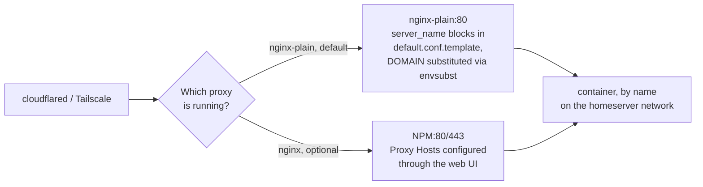

# 04 — Reverse Proxy

[← Access Setup](03-access.md) | [Home](../setup.md) | [Next: Nextcloud →](05-nextcloud.md)

---

Two reverse proxy options — **run only one at a time**, both bind to ports 80/443.

| Option | Service | Best for |
| --- | --- | --- |
| `nginx-plain` | Plain nginx with template config | **Default** — config-file based, domain-templated |
| `nginx` (NPM) | Nginx Proxy Manager | UI-based config, Let's Encrypt via browser |



Both resolve a service the same way underneath (container name on the `homeserver` network) — they differ only in *how* that mapping gets configured: a text template vs. a web UI. Mutually exclusive because both claim ports 80/443.

---

## nginx-plain (default)

Config lives in `nginx-plain/templates/default.conf.template`.
At container start, nginx substitutes `${DOMAIN}` with the value from root `.env`.

```bash
uv run homeserver.py dev up nginx-plain
```

Every service already has a `server_name <service>.${DOMAIN}` block in the template.
To add a new service: edit the template, add a `server` block, then recreate the container:

```bash
uv run homeserver.py dev up nginx-plain
# (docker compose recreates the container, envsubst re-runs)
```

No UI — all config is in the template file.

---

## Nginx Proxy Manager (optional)

UI-based proxy with a web interface for adding proxy hosts and managing Let's Encrypt certs.

```bash
uv run homeserver.py dev up nginx
```

Admin UI:

- **Cloudflare path:** `http://localhost:81` (or SSH tunnel: `ssh -L 8181:127.0.0.1:81 user@server`)
- **Tailscale path:** `http://100.x.x.x:81`

Default login: `admin@example.com` / `changeme` — change immediately.

Go to **Proxy Hosts → Add Proxy Host** for each service.
The Forward Hostname is the Docker **container name** — NPM resolves via the `homeserver` network.

> No SSL certs in NPM when using Cloudflare — Cloudflare handles TLS at the edge.
> Adding certs here causes double-encryption.

→ See [11 — Services Reference](11-services-reference.md) for the full proxy host table.

---

## Switching between proxies

To switch from `nginx-plain` to NPM (or back):

1. Stop the current proxy: `uv run homeserver.py dev down nginx-plain` (or `nginx`)
2. In `homeserver.py`, move the service between `SERVICES_MIN` / `SERVICES_CORE` as needed
3. Start the new proxy: `uv run homeserver.py dev up nginx`

Both are in `SERVICES_EXTRA` by default except `nginx-plain` which is in `SERVICES_MIN`.

---

[← Access Setup](03-access.md) | [Home](../setup.md) | [Next: Nextcloud →](05-nextcloud.md)
