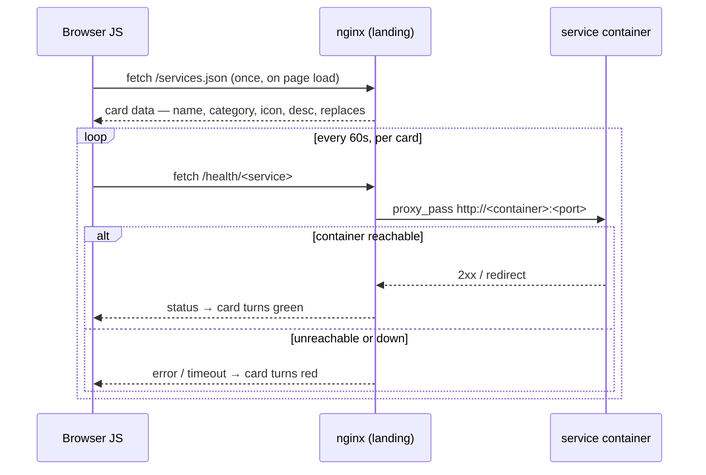

# 07 — Landing Page

[← Immich](06-immich.md) | [Home](../setup.md) | [Next: Maintenance →](08-maintenance.md)

---

A service dashboard served by Nginx Alpine. Shows all services with **live status indicators** —
green when up, red when down, rechecked every 60 seconds.

## Files

| File | Purpose |
| --- | --- |
| `index.html` | Dashboard UI template with placeholders |
| `entrypoint.sh` | Replaces placeholders with `.env` values at startup |
| `nginx.conf` | Serves HTML + `/health/*` proxy endpoints |
| `docker-compose.yml` | Base config (no ports) |
| `compose.dev.yml` | Exposes port `8080` on all interfaces |
| `compose.prod.yml` | Exposes port `8080` on `127.0.0.1` only |
| `.env` | `DOMAIN`, `SITE_NAME`, `TAGLINE`, `AUTHOR`, `LOCATION` |

## Dynamic configuration

The landing page is fully dynamic — no domain or personal info is hardcoded.
Set these in `services/landing/.env`:

```env
DOMAIN=yourdomain.com
SITE_NAME=MyServer
TAGLINE=Your data, your hardware, your control.
AUTHOR=Your Name
LOCATION=Your City
```

`entrypoint.sh` runs `sed` at container start to replace placeholders in `index.html`
before nginx serves it.

## How live status works

The browser fetches `services.json` once on page load to build every card, then polls each
card's health endpoint every 60 seconds — same-origin, no CORS issues. Nginx proxies each
request to the real container via the internal Docker network.



Health endpoints are in `nginx.conf`. Docker's internal DNS (`127.0.0.11`) with
`set $upstream` defers resolution — the landing container starts even if other services are down.

Redirects (e.g. GitLab's 302) are treated as online using `redirect: 'manual'` in the
JS fetch call — opaque responses count as up.

## Card content

`desc` (what the service does, written for both technical and non-technical readers) is
shown as visible text on every card. `replaces` (the familiar product it substitutes for,
e.g. `"Google Drive"`) is optional — services with no direct commercial equivalent
(Portainer, Dozzle, Airflow, etc.) omit it — and isn't shown as its own line on the card;
instead `buildCard()` folds it into the card's `title` attribute alongside `desc`, so
hovering (or tap-and-hold on mobile) any card shows both in one native tooltip.

`buildCard()` skips the `" Replaces: X."` suffix when `desc` already names that product
(case-insensitive substring check on each `/`-separated alternative) — several `desc`
strings read more naturally by naming the familiar equivalent directly (e.g. nextcloud's
`"...Google Drive alternative with calendar, contacts, and more."`), and appending
`"Replaces: Google Drive."` after that would just say it twice.

This mirrors the tooltip pattern used for every service link in `setup.md`'s "What's in
the stack" section and in `_sidebar.md` — same computed text (same `desc`, same
redundancy-skip rule), three places, kept in sync deliberately (see the
`homeserver-add-service` skill's index-files step).

## Start

```bash
uv run homeserver.py dev up landing
```

## Access

- **Cloudflare path:** `https://yourdomain.com` (nginx-plain proxies `landing:80`)
- **Tailscale / dev path:** `http://<server-ip>:8080`

## Add a new service to the dashboard

Cards are no longer hand-written in `index.html` — they're generated at page load from
`services.json` (repo root), which is also `homeserver.py`'s source of truth for tier
membership. One entry drives both, so there's no second file to keep in sync.

1. Add one entry to the `services` array in `services.json` — `slug`/`tier` plus, for a
   landing card, `name`/`category`/`icon`/`svg`/`desc`, and optionally `replaces` (see the
   `homeserver-add-service` skill for the full field reference)
2. Add a `/health/<service>` location block in `landing/nginx.conf` **and**
   `nginx.podman.conf`
3. `services.json` is a live bind mount — editing it takes effect on the next browser
   refresh, **no container restart needed**. `nginx.conf` changes do need one, since
   `entrypoint.sh` only re-templates it at container start.

   In practice, though, if `services.json` ever 404s or the landing page shows stale
   cards right after an edit, recreate the container anyway — `services.json` is bind-mounted
   as a single file, and an editor that saves via write-temp-then-rename replaces the
   underlying inode, orphaning the running container's mount even though `docker inspect`
   still lists it. `uv run homeserver.py dev restart landing` does a full recreate, which
   fixes it. Hit this in practice; see [docs](services/docs.md)'s Notes for the same
   failure mode with `setup.md`.

```bash
uv run homeserver.py dev up landing
```

---

[← Immich](06-immich.md) | [Home](../setup.md) | [Next: Maintenance →](08-maintenance.md)
