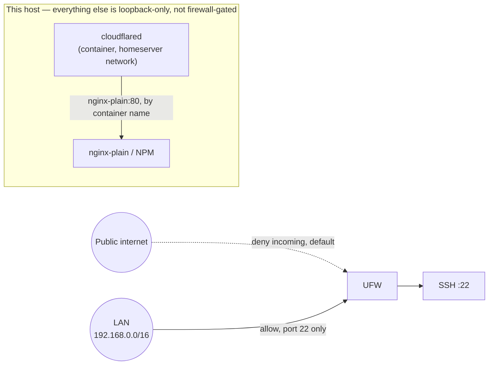
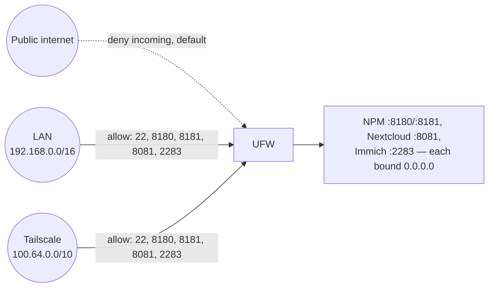

# 09 — Firewall

[← Maintenance](08-maintenance.md) | [Home](../setup.md) | [Next: New Services →](10-new-services.md)

---

## Rootless Podman — Privileged Ports

Rootless Podman cannot bind to ports below 1024. This stack sidesteps the issue entirely by never binding a privileged host port for any runtime — `nginx-plain` and `nginx` (NPM) both map their HTTP/HTTPS host ports to 8180/8443 (NPM's admin UI to 8181) in `compose.dev.yml`/`compose.prod.yml` regardless of whether you're running Docker or Podman, rootless or not. This isn't a Podman-only accommodation — it's the stack's permanent host-port scheme.

| Service | Standard port | Host port | Protocol |
| --- | --- | --- | --- |
| nginx-plain / nginx (NPM) | 80 | 8180 | HTTP |
| nginx-plain / nginx (NPM) | 443 | 8443 | HTTPS |
| nginx (NPM) | 81 | 8181 | Admin UI |

All admin/UI ports bind directly — they are above 1024.

### Forwarding standard ports to remapped ports

External clients and mail servers connect to the standard ports. A firewall redirect rule on the host transparently forwards them to the remapped ports.

No service in this stack currently needs privileged-port forwarding under rootless Podman — this section is a placeholder for if one ever does (e.g. `firewall-cmd --add-forward-port` / `iptables -t nat -A PREROUTING -j REDIRECT`, same pattern as the nginx-plain row above).

---

## The Docker / UFW problem

Docker writes iptables rules directly and **bypasses UFW entirely**. A `ufw deny 80` rule will not stop a container that has `ports: - "80:80"` — Docker opens that port regardless.

The correct fix is to **bind ports to a specific IP in the compose override**, not rely on UFW alone:

| Binding | Reachable from |
| --- | --- |
| `80:80` | Anywhere (`0.0.0.0`) |
| `127.0.0.1:80:80` | Localhost only |

This stack uses **compose override files** to manage port bindings per environment. The base `compose.yml` for each service has no `ports:` block. You add ports by merging an override at startup.

```text
nginx/
├── compose.yml          ← base (no ports)
├── compose.prod.yml     ← ports bound to 127.0.0.1
└── compose.dev.yml      ← ports bound to 0.0.0.0

nextcloud/
├── compose.yml          ← base (no ports)
└── compose.dev.yml      ← adds port 8081

immich/
├── compose.yml          ← base (no ports)
└── compose.dev.yml      ← adds port 2283
```

---

## Production — Cloudflare Tunnel

### How traffic flows

`cloudflared` makes an outbound connection to Cloudflare — no inbound ports are needed from the internet. It runs as a container on the `homeserver` Docker network and reaches nginx-plain (or NPM) directly by container name — it never goes through a host-bound port at all. The host ports below exist for NPM's admin UI and any direct/local access, not for the Cloudflare Tunnel path itself.



Nothing but SSH is UFW-reachable from the LAN. NPM's ports (8180/8443/8181) are bound to `127.0.0.1` by the `compose.prod.yml` override — loopback-only, as defense in depth for the admin UI and any local testing. `cloudflared` doesn't use them at all; it reaches nginx-plain/NPM over the `homeserver` Docker network.

### Start commands

```bash
# NPM — localhost-only ports via prod override
cd ~/homeserver/nginx
docker compose -f compose.yml -f compose.prod.yml up -d

# Nextcloud and Immich — no ports needed, NPM routes via Docker network
cd ~/homeserver/nextcloud && docker compose up -d
cd ~/homeserver/immich && docker compose up -d
cd ~/homeserver/landing && docker compose up -d
```

### UFW rules

```bash
sudo ufw default deny incoming
sudo ufw default allow outgoing

sudo ufw allow from 192.168.0.0/16 to any port 22 comment 'SSH LAN'

sudo ufw enable
sudo ufw status verbose
```

> Adjust `192.168.0.0/16` to your actual LAN subnet (e.g. `192.168.1.0/24`).

### What's open

| Port | Binding | Access | Why |
| --- | --- | --- | --- |
| 22 | — | LAN only | SSH |
| 8180 | `127.0.0.1` | localhost only | nginx-plain/NPM HTTP — not used by cloudflared (it connects via the `homeserver` Docker network); loopback-only for local admin/testing |
| 8443 | `127.0.0.1` | localhost only | nginx-plain/NPM HTTPS — same |
| 8181 | `127.0.0.1` | localhost only | NPM admin |
| 8081, 2283 | not exposed | none | Docker-internal via homeserver network |

To reach NPM admin remotely without exposing port 8181 to the LAN, use an SSH tunnel from your Mac:

```bash
ssh -L 8181:127.0.0.1:8181 user@server-ip
# then open http://localhost:8181
```

---

## Testing — Tailscale

### How traffic flows

Services are accessed by Tailscale IP directly. Ports need to be reachable on that interface, so the dev overrides bind to `0.0.0.0`.



Unlike the production path, these ports are genuinely bound to all interfaces (`0.0.0.0` via the dev override) — UFW is the only thing keeping them scoped to your LAN and tailnet instead of the public internet.

### Start commands

```bash
# NPM — all interfaces via dev override
cd ~/homeserver/nginx
docker compose -f compose.yml -f compose.dev.yml up -d

# Nextcloud — exposes 8081 via dev override
cd ~/homeserver/nextcloud
docker compose -f compose.yml -f compose.dev.yml up -d

# Immich — exposes 2283 via dev override
cd ~/homeserver/immich
docker compose -f compose.yml -f compose.dev.yml up -d

cd ~/homeserver/landing && docker compose up -d
```

### UFW rules

```bash
sudo ufw default deny incoming
sudo ufw default allow outgoing

# SSH
sudo ufw allow from 192.168.0.0/16 to any port 22 comment 'SSH LAN'
sudo ufw allow from 100.64.0.0/10 to any port 22 comment 'SSH Tailscale'

# NPM
sudo ufw allow from 192.168.0.0/16 to any port 8180 comment 'NPM LAN'
sudo ufw allow from 100.64.0.0/10 to any port 8180 comment 'NPM Tailscale'

# NPM admin
sudo ufw allow from 192.168.0.0/16 to any port 8181 comment 'NPM admin LAN'
sudo ufw allow from 100.64.0.0/10 to any port 8181 comment 'NPM admin Tailscale'

# Nextcloud
sudo ufw allow from 192.168.0.0/16 to any port 8081 comment 'Nextcloud LAN'
sudo ufw allow from 100.64.0.0/10 to any port 8081 comment 'Nextcloud Tailscale'

# Immich
sudo ufw allow from 192.168.0.0/16 to any port 2283 comment 'Immich LAN'
sudo ufw allow from 100.64.0.0/10 to any port 2283 comment 'Immich Tailscale'

sudo ufw enable
sudo ufw status verbose
```

> `100.64.0.0/10` is the full Tailscale CGNAT range. Adjust `192.168.0.0/16` to your LAN subnet.

### What's open

| Port | Binding | Access | Why |
| --- | --- | --- | --- |
| 22 | — | LAN + Tailscale | SSH |
| 8180 | `0.0.0.0` | LAN + Tailscale | NPM |
| 8181 | `0.0.0.0` | LAN + Tailscale | NPM admin |
| 8081 | `0.0.0.0` | LAN + Tailscale | Nextcloud direct |
| 2283 | `0.0.0.0` | LAN + Tailscale | Immich direct |

---

## Verify

```bash
# show active UFW rules
sudo ufw status numbered

# confirm port binding (should show 127.0.0.1 for prod, 0.0.0.0 for dev)
sudo ss -tlnp | grep -E '8180|8443|8181|8081|2283'

# test a port is blocked from another machine (should time out)
nc -zv server-ip 8180
```

---

## Moving from testing to production

When you switch from Tailscale to Cloudflare Tunnel:

1. Complete [03a — Cloudflare Tunnel](03a-cloudflare.md)
2. Restart services with prod overrides:

```bash
cd ~/homeserver/nginx
docker compose -f compose.yml -f compose.dev.yml down
docker compose -f compose.yml -f compose.prod.yml up -d

cd ~/homeserver/nextcloud
docker compose down && docker compose up -d

cd ~/homeserver/immich
docker compose down && docker compose up -d
```

1. Reset and replace UFW rules:

```bash
sudo ufw reset
# apply production UFW rules above
```

---

[← Maintenance](08-maintenance.md) | [Home](../setup.md) | [Next: New Services →](10-new-services.md)
