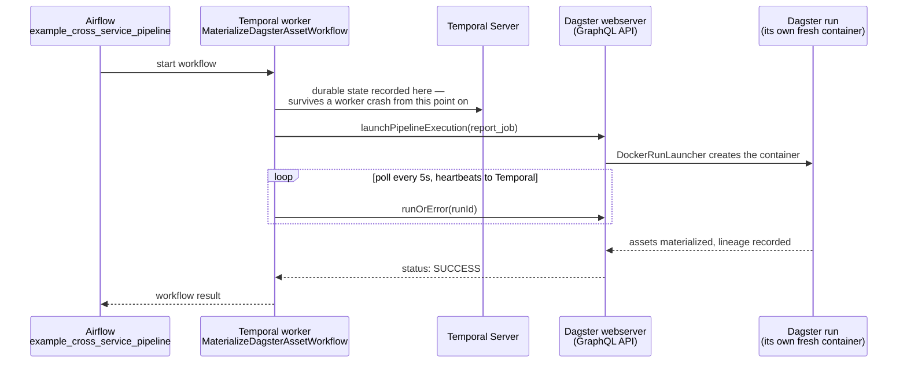

# Orchestration services: Airflow, Temporal, Dagster — how they relate

[← Services Reference](11-services-reference.md) | [Home](../setup.md)

---

Three different answers to "run this thing, reliably, on a schedule or in response to something." Per-service setup, architecture, and worked examples live in each one's own doc — [`airflow.md`](services/airflow.md), [`temporal.md`](services/temporal.md), [`dagster.md`](services/dagster.md). This doc is only the comparison those three don't make of themselves.

## The actual difference, not just the marketing

| | Primary unit | What it's fundamentally for |
| --- | --- | --- |
| **Airflow** | a *task* (a step in a DAG) | scheduling and sequencing steps — the step is what matters, not what it produces |
| **Dagster** | an *asset* (a piece of data) | tracking what data exists and how it depends on other data — the data is what matters, tasks are incidental |
| **Temporal** | a *workflow* (durable business logic) | making a multi-step process survive crashes, retries, and arbitrarily long waits — durability is what matters, not scheduling or data |

None of the three is a strict superset of the others. Airflow can move data and Dagster can be scheduled and Temporal can call Docker containers — but each one's actual design center is different, and reaching for the wrong one means fighting the tool for anything outside that center.

## "Assets" means two different things here — this bit us once already

Airflow 3.0 renamed its "Dataset" feature to "Asset," which now collides in name with Dagster's core concept:

- **Airflow's Asset** (`example_asset_triggered.py`) is a *label* a task's output is tagged with (`outlets=[Asset(...)]`), used only to trigger a *different* DAG when that label updates. The task/DAG structure underneath is still primary — this is a thin cross-DAG-triggering mechanism, not a data model.
- **Dagster's asset** (`raw_data`/`cleaned_data`/`report` in `definitions.py`) *is* the primary unit — the `@asset`-decorated function itself, with lineage inferred from its own signature. There is no separate task layer underneath it to point at.

If you're coming from Dagster and see "Assets" in the Airflow UI expecting the same thing, you'll be looking for lineage graphs that don't exist there — it's a scheduling trigger, not a data catalog.

## Backdated / historical processing — three different mechanisms

This comes up as soon as a source system needs reprocessing for a past date, and each tool answers it differently:

- **Airflow — catchup/backfill, whole-DAG-run granularity.** `example_backfill.py`: `catchup=True` + a `start_date` in the past means unpausing the DAG creates one full run per missed schedule interval automatically. Ad hoc, for an already-running DAG: `airflow backfill create --from-date ... --to-date ...`. The unit of reprocessing is an entire DAG run — every task in it, for that date.
- **Dagster — partitions, per-asset granularity.** `daily_sales` in `definitions.py`: a `DailyPartitionsDefinition` makes each calendar day an independent, individually-materializable unit. Backfilling one old date is materializing that one partition — not a separate operation layered on top, the same UI/CLI path as any other materialization, just pointed at an old partition key. Unlike Airflow, you can backfill *one asset* for a date range without touching any other asset in the pipeline.
- **Temporal — neither, generally.** Temporal isn't built around scheduled batch reprocessing of a date range; it's for a *single logical process* (an order, an approval, a signup) staying durable and correct over its own lifetime, however long that is. Its scheduling (`temporal schedule create`, see `temporal.md`) starts new workflow instances on a cron, but there's no first-class "reprocess these 30 past days" concept the way Airflow/Dagster have — if you need that, it belongs in Airflow or Dagster, not Temporal.

The granularity difference, drawn — this is the actual point, not just a wording difference:

## When to reach for which

- **A known sequence of steps on a schedule, especially moving data between systems** (extract/transform/load, calling a chain of APIs in order) → **Airflow**. Huge operator ecosystem, mature scheduling, the default choice for "just run this pipeline nightly."
- **You care what data exists, where it came from, and whether it's still fresh/valid** → **Dagster**. Lineage and Asset Checks are first-class; reprocessing one partition instead of a whole pipeline is often the actual point.
- **A multi-step process that must not be lost partway through** — anything touching money, inventory, or multiple services that need to stay consistent, or that waits on a human/external event for an unpredictable amount of time → **Temporal**. The Saga pattern (`OrderFulfillmentSagaWorkflow`) and the Signal/Query pair (`ApprovalWorkflow`) are the shapes this solves that the other two don't attempt.

They're not mutually exclusive — see below.

## They compose: the cross-service example actually running in this stack

`example_cross_service_pipeline` (Airflow) → `MaterializeDagsterAssetWorkflow` (Temporal) → `report_job` (Dagster), each tool doing the one thing above it's actually best at: **Airflow schedules it, Temporal durably waits on it (survives a worker crash mid-poll with zero state lost), Dagster materializes the asset with lineage.** Verified running end to end — see `temporal.md`'s and `dagster.md`'s "Try the starter examples" sections for how to trigger it yourself.

## Your own code never fights git, in all three

Same pattern everywhere: a **git-tracked template** (`services/<name>/dags-examples/` for Airflow, `services/<name>/worker/*.py` for Temporal, `services/dagster/user-code/definitions.py` for Dagster) seeds a **gitignored live copy** under `service_data/data/<name>/` once, during setup. After that the two are independent — edit your own DAGs/workflows/assets freely, a `git pull` on this repo never touches them. Airflow already worked this way (`DATA_ROOT/dags` was always a bind mount); Temporal and Dagster's user code used to be baked into their images at build time, which meant editing it either meant fighting a rebuild or, worse, having nowhere safe to put it that `git pull` wouldn't eventually clobber — both were restructured to match Airflow's pattern for this reason. Each service's own doc has the exact setup command.

---

[← Services Reference](11-services-reference.md) | [Home](../setup.md)
