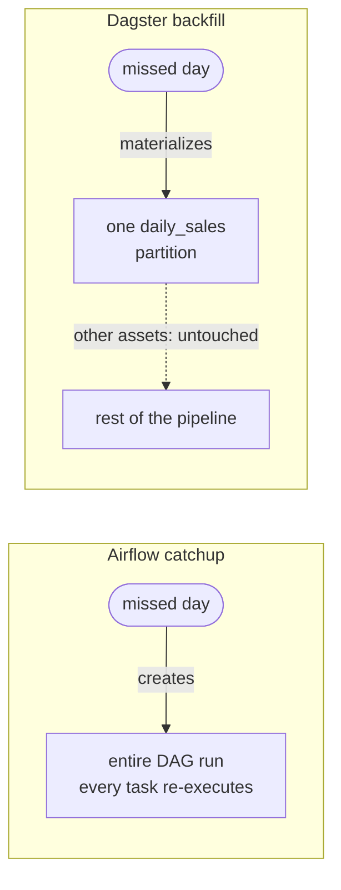
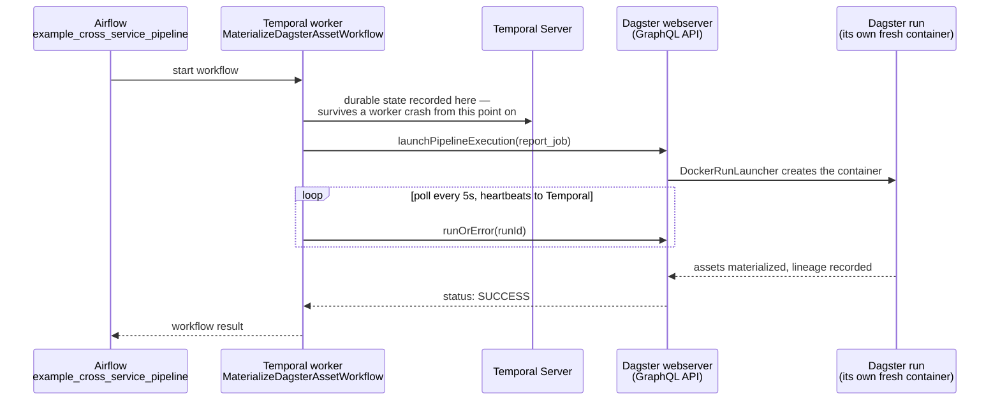

# Orchestration services: Airflow, Temporal, Dagster — how they relate

[← Services Reference](11-services-reference.md) | [Home](../setup.md)

---

Three different answers to "run this thing, reliably, on a schedule or in response to something." Per-service setup, architecture, and worked examples live in each one's own doc — [`airflow.md`](services/airflow.md), [`temporal.md`](services/temporal.md), [`dagster.md`](services/dagster.md). This doc is only the comparison those three don't make of themselves.

## The actual difference, not just the marketing

| | Primary unit | What it's fundamentally for |
| --- | --- | --- |
| **Airflow** | a *task* (a step in a DAG) | scheduling and sequencing steps — the step is what matters, not what it produces |
| **Dagster** | an *asset* (a piece of data) | tracking what data exists and how it depends on other data — the data is what matters, tasks are incidental |
| **Temporal** | a *workflow* (durable business logic) | making a multi-step process survive crashes, retries, and arbitrarily long waits — durability is what matters, not scheduling or data |

None of the three is a strict superset of the others. Airflow can move data and Dagster can be scheduled and Temporal can call Docker containers — but each one's actual design center is different, and reaching for the wrong one means fighting the tool for anything outside that center.

## "Assets" means two different things here — this bit us once already

Airflow 3.0 renamed its "Dataset" feature to "Asset," which now collides in name with Dagster's core concept:

- **Airflow's Asset** (`example_asset_triggered.py`) is a *label* a task's output is tagged with (`outlets=[Asset(...)]`), used only to trigger a *different* DAG when that label updates. The task/DAG structure underneath is still primary — this is a thin cross-DAG-triggering mechanism, not a data model.
- **Dagster's asset** (`raw_data`/`cleaned_data`/`report` in `definitions.py`) *is* the primary unit — the `@asset`-decorated function itself, with lineage inferred from its own signature. There is no separate task layer underneath it to point at.

If you're coming from Dagster and see "Assets" in the Airflow UI expecting the same thing, you'll be looking for lineage graphs that don't exist there — it's a scheduling trigger, not a data catalog.

## Backdated / historical processing — three different mechanisms

This comes up as soon as a source system needs reprocessing for a past date, and each tool answers it differently:

- **Airflow — catchup/backfill, whole-DAG-run granularity.** `example_backfill.py`: `catchup=True` + a `start_date` in the past means unpausing the DAG creates one full run per missed schedule interval automatically. Ad hoc, for an already-running DAG: `airflow backfill create --from-date ... --to-date ...`. The unit of reprocessing is an entire DAG run — every task in it, for that date.
- **Dagster — partitions, per-asset granularity.** `daily_sales` in `definitions.py`: a `DailyPartitionsDefinition` makes each calendar day an independent, individually-materializable unit. Backfilling one old date is materializing that one partition — not a separate operation layered on top, the same UI/CLI path as any other materialization, just pointed at an old partition key. Unlike Airflow, you can backfill *one asset* for a date range without touching any other asset in the pipeline.
- **Temporal — neither, generally.** Temporal isn't built around scheduled batch reprocessing of a date range; it's for a *single logical process* (an order, an approval, a signup) staying durable and correct over its own lifetime, however long that is. Its scheduling (`temporal schedule create`, see `temporal.md`) starts new workflow instances on a cron, but there's no first-class "reprocess these 30 past days" concept the way Airflow/Dagster have — if you need that, it belongs in Airflow or Dagster, not Temporal.

The granularity difference, drawn — this is the actual point, not just a wording difference:

## When to reach for which

- **A known sequence of steps on a schedule, especially moving data between systems** (extract/transform/load, calling a chain of APIs in order) → **Airflow**. Huge operator ecosystem, mature scheduling, the default choice for "just run this pipeline nightly."
- **You care what data exists, where it came from, and whether it's still fresh/valid** → **Dagster**. Lineage and Asset Checks are first-class; reprocessing one partition instead of a whole pipeline is often the actual point.
- **A multi-step process that must not be lost partway through** — anything touching money, inventory, or multiple services that need to stay consistent, or that waits on a human/external event for an unpredictable amount of time → **Temporal**. The Saga pattern (`OrderFulfillmentSagaWorkflow`) and the Signal/Query pair (`ApprovalWorkflow`) are the shapes this solves that the other two don't attempt.

**Inside Dagster specifically**, assets aren't the only option: `ops_pipeline_job` in `definitions.py` is the older `@op`/`@job` style, wired by explicit function calls instead of Dagster inferring an edge from a parameter name. Reach for ops when a pipeline's steps aren't naturally shaped around producing/tracking a piece of data (a batch of side-effecting actions — send some emails, hit some webhooks) or you're integrating code that's already written that way — assets remain the default for anything data-shaped, which is most things.

They're not mutually exclusive — see below.

## Feature parity — the same concept, three tools (or two, or one)

Easy to assume a concept you've only seen demoed in one of these three is exclusive to it — it usually isn't; it's just which example got written up. Same concept, one worked, verified example per tool that actually has it — `—` means that tool genuinely doesn't do this natively, by design, not an oversight:

| Concept | Airflow | Temporal | Dagster |
| --- | --- | --- | --- |
| Retries with backoff | `example_scheduled_with_retries` | `RetryableActivityWorkflow` (`flaky_activity`) | `flaky_retry_asset` |
| Wait for an external condition | `example_sensor` / `example_file_sensor` (built-in `FileSensor`) | `ApprovalWorkflow` (`wait_condition()` + Signal) | `marker_file_sensor` |
| Human-in-the-loop approval | `example_human_in_the_loop` (`ApprovalOperator`, Airflow 3.1+) | `ApprovalWorkflow` | — (closest analog is a sensor waiting on an external signal, not a first-class approval gate) |
| One unit depending on another | `example_cross_dag_dependencies` (`ExternalTaskSensor` pull + `TriggerDagRunOperator` push) | `execute_child_workflow` (`BatchProcessingWorkflow`) | parameter-name dependency (`raw_data`→`cleaned_data`) — data lineage, a genuinely different kind of "depends on" than the other two |
| Scheduling on a cron | `schedule="@daily"` (`example_scheduled_with_retries`) | `temporal schedule create` (see `temporal.md`, client-side construct — no workflow code of its own) | `report_daily_schedule` |
| Capping concurrent executions | `example_max_active_runs` (`max_active_runs=1`) | `Worker`'s `max_concurrent_*` (documented in `worker.py`, process-wide, not per-workflow) | `pool=` (documented in `reference_op`, not demoed live) |
| Resource-bounded per-step execution | `example_docker_operator` | `RunContainerWorkflow` | `docker_executor` (every asset in this stack's `definitions.py`) |
| Fan-out / parallelism | `example_parallel_tasks` | `BatchProcessingWorkflow` (`asyncio.gather` children) | `docker_executor` can run independent assets' steps concurrently (subject to its own concurrency limits) — not independently verified here, no dedicated fan-out demo |
| Backfill / historical reprocessing | `example_backfill` (whole-DAG-run) | — (not a Temporal concept — see "Backdated / historical processing" above) | `daily_sales` (per-partition) |
| Compensation on partial failure (Saga) | — (write your own on-failure cleanup tasks) | `OrderFulfillmentSagaWorkflow` | — |
| Data lineage / catalog | — (Airflow's own "Asset" is a trigger label, not lineage — see above) | — | `raw_data`→`cleaned_data`→`report`, `customer_orders` |
| Built-in data-quality checks | — | — | `report_freshness_check` |
| Durable long wait / timer | — | `DelayedReminderWorkflow` | — |
| Runtime-determined number of parallel units | `example_dynamic_task_mapping` (`.expand()`) | — | — |
| Built-in secrets/config store | `example_variables_and_connections` | — | `ConfigurableResource` (a config object, not quite a secrets store) |

## Built-in features that mean you don't need another service

Each tool bundles a capability that would otherwise mean standing up something separate elsewhere in this stack. Worth knowing before reaching for a dedicated service out of habit:

- **Dagster's asset metadata is a real data catalog, built in.** `customer_orders` in `definitions.py` — `description`/`owners`/`kinds` on the asset itself, plus a real column-by-column schema (`TableSchema`/`TableColumn`) and a computed preview attached to every materialization. [Dagster's own docs](https://dagster.io/platform-overview/data-catalog) draw the contrast deliberately: a standalone catalog tool ingests metadata from external systems *after the fact* and drifts stale; this is captured live, as a byproduct of the run that just happened, so it can't drift. No separate data-catalog service needed for "what does this data actually look like."
- **Dagster's Asset Checks are a lightweight data-quality tool, built in.** `report_freshness_check` — a pass/fail validation attached directly to the asset it checks, visible right on that asset's page. Not a Great-Expectations-class rules engine, but covers the common case (row counts, null checks, freshness) without a second service to deploy and keep in sync with the pipeline.
- **Temporal's Saga pattern + retry policies replace hand-rolled reliability plumbing.** `OrderFulfillmentSagaWorkflow` — Temporal tracks the full execution state of the workflow itself rather than moving messages between services, so there's no dead-letter queue, no separate state-tracking table, no retry-counter logic to write. The tradeoff, from Temporal's own guidance: it only pays for itself once you're spending real engineering time on exactly this kind of plumbing — it's not a blanket replacement for a message queue, just for the durable-execution slice of what one would otherwise be doing.
- **Temporal's Signals/Queries/Updates replace a message queue for human-in-the-loop.** `ApprovalWorkflow` — "pause a process until a human acts, durably, for however long that takes" needs no external queue or polling service; the workflow itself durably waits. Airflow independently ships the same underlying idea as a first-class primitive since 3.1 — `example_human_in_the_loop` (`ApprovalOperator`) — no Signal-handling code required, at the cost of the flexibility Temporal's Signal/Query pair gives you (Airflow's version is a fixed Approve/Reject gate; Temporal's is whatever your workflow code decides to expose). Dagster has no equivalent primitive — the closest analog is a sensor waiting on an external signal, same shape as `marker_file_sensor`.
- **Temporal's Schedules + Batch replace a cron container and a scripted loop.** `temporal.md`'s Schedule example (`--interval`/`--cron`, verified firing on its own) and Batch example (`temporal workflow signal --query ...` against many workflows at once, verified `3/3` completed) — no separate cron sidecar, no hand-written loop over a workflow list.
- **Temporal's Namespaces replace 2-3 separate deployments for environment isolation.** `default`/`staging`/`production`, verified running the identical workflow ID independently in all three with zero collision — one cluster instead of three.
- **Airflow's FabAuthManager is real login, built in.** The one genuine asymmetry worth naming: Airflow ships actual username/password auth with RBAC and audit logging (`_AIRFLOW_WWW_USER_USERNAME`/`PASSWORD` in `airflow/.env`) — Temporal and Dagster explicitly have **none** (see both their Notes sections). No Authentik forward-auth needed for Airflow specifically; it's the one of the three that doesn't need help here.
- **Airflow's Variables/Connections are a lightweight secrets store, built in.** Fernet-encrypted in Airflow's own metadata DB (`FERNET_KEY` in `.env`) — no external secrets backend required for homelab-scale pipeline credentials, reducing the case for routing every pipeline secret through Vaultwarden. (Airflow also supports pluggable external backends — AWS/GCP Secrets Manager, Vault — for when that's not enough; not needed at this scale.)
- **Airflow's email alerting replaces wiring up ntfy just for pipeline failures — and actually works, not just documented.** `AIRFLOW__EMAIL__DEFAULT_EMAIL_ON_RETRY`/`ON_FAILURE` point at [Mailpit](services/mailpit.md), a shared SMTP catcher any service in this stack can use (`SMTP_HOST`/`PORT`/`FROM_EMAIL` in `airflow/.env`) — nothing leaves the host, but a real failure genuinely sends a real email, verified end to end (`example_email_alert_on_failure.py` in `airflow.md`). No separate notification service needed once you point `SMTP_HOST` at a real relay instead.

## They compose: the cross-service example actually running in this stack

`example_cross_service_pipeline` (Airflow) → `MaterializeDagsterAssetWorkflow` (Temporal) → `report_job` (Dagster), each tool doing the one thing above it's actually best at: **Airflow schedules it, Temporal durably waits on it (survives a worker crash mid-poll with zero state lost), Dagster materializes the asset with lineage.** Verified running end to end — see `temporal.md`'s and `dagster.md`'s "Try the starter examples" sections for how to trigger it yourself.

## Your own code never fights git, in all three

Same pattern everywhere: a **git-tracked template** (`services/<name>/dags-examples/` for Airflow, `services/<name>/worker/*.py` for Temporal, `services/dagster/user-code/definitions.py` for Dagster) seeds a **gitignored live copy** under `service_data/data/<name>/` once, during setup. After that the two are independent — edit your own DAGs/workflows/assets freely, a `git pull` on this repo never touches them. Airflow already worked this way (`DATA_ROOT/dags` was always a bind mount); Temporal and Dagster's user code used to be baked into their images at build time, which meant editing it either meant fighting a rebuild or, worse, having nowhere safe to put it that `git pull` wouldn't eventually clobber — both were restructured to match Airflow's pattern for this reason. Each service's own doc has the exact setup command.

---

[← Services Reference](11-services-reference.md) | [Home](../setup.md)
