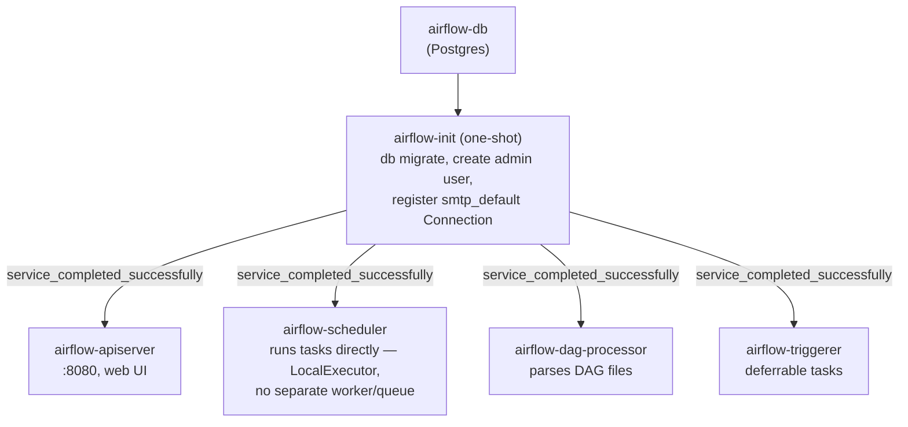

# Airflow

[← Services Reference](../11-services-reference.md) | [Home](../../setup.md)

---

**Purpose:** Programmatically author, schedule, and monitor workflows as Python DAGs — the industry-standard workflow orchestrator.
**Port:** `8137` (host) → `8080` (container, `airflow-apiserver`) | **Data:** `service_data/data/airflow/` (`dags/`, `logs/`, `config/`, `plugins/`) | **Requires:** Postgres

## Setup

```bash
cp services/airflow/.env.example services/airflow/.env
# generate real values for FERNET_KEY, JWT_SECRET, API_SECRET_KEY, POSTGRES_PASSWORD, _AIRFLOW_WWW_USER_PASSWORD
mkdir -p service_data/data/airflow/dags
cp services/airflow/dags-examples/*.py service_data/data/airflow/dags/   # optional — the starter examples below
uv run homeserver.py dev up airflow
```

`services/airflow/dags-examples/` is a **git-tracked template** — `service_data/data/airflow/dags/` (bind-mounted, gitignored) is where Airflow actually reads from and where your own DAGs go. The copy step seeds your live folder with the starter examples once; after that the two are independent — edit/delete freely in `service_data/`, it never touches git, and a `git pull` on this repo never overwrites your own DAGs. This is the same relationship `.env.example`/`.env` already has, just for a whole directory instead of one file.

## First login

Browse to `https://airflow.<domain>/` (or `http://<host>:8137` in dev) and log in with `_AIRFLOW_WWW_USER_USERNAME`/`_AIRFLOW_WWW_USER_PASSWORD` from `.env`.

## Architecture — LocalExecutor, not the official CeleryExecutor default

The [official docker-compose.yaml](https://airflow.apache.org/docs/apache-airflow/stable/howto/docker-compose/index.html) ships `CeleryExecutor` by default — an 8-container setup (`postgres`, `redis`, `airflow-apiserver`, `airflow-scheduler`, `airflow-dag-processor`, `airflow-worker`, `airflow-triggerer`, `airflow-init`, plus optional `flower`) built for distributed multi-worker task execution.

This deployment uses `LocalExecutor` instead — tasks run directly inside the scheduler process, no separate task queue needed. Drops `redis`, `airflow-worker`, and `flower` entirely: 6 containers total (`airflow-db`, `airflow-init`, `airflow-apiserver`, `airflow-scheduler`, `airflow-dag-processor`, `airflow-triggerer`) instead of 8+. Airflow 3.x still requires `airflow-dag-processor` as a separate process regardless of executor (DAG parsing moved out of the scheduler for security/isolation in the 3.x rearchitecture) — it isn't Celery-specific, so it stays.

`airflow-init` is one-shot (`restart: "no"`) — runs `airflow db migrate`, creates the admin user, and registers an `smtp_default` Connection pointing at `mailpit`, then exits successfully. The other four app containers wait on `service_completed_successfully` before starting.



No `redis`/`airflow-worker`/`flower` — those only exist to support `CeleryExecutor`'s distributed task queue, which this deployment doesn't use.

`AIRFLOW__EMAIL__*` alerting is pointed at [Mailpit](../services/mailpit.md), a shared SMTP catcher used by other services in this stack too (not scoped to Airflow) — nothing leaves this host. See `example_email_alert_on_failure.py` below.

## Required env vars

- `FERNET_KEY` — encrypts connection passwords/variables at rest in the metadata DB. Generate: `python3 -c "import secrets, base64; print(base64.urlsafe_b64encode(secrets.token_bytes(32)).decode())"`. Rotating this after DAGs/connections exist makes existing encrypted values unreadable.
- `JWT_SECRET` (`AIRFLOW__API_AUTH__JWT_SECRET`) — internal auth between scheduler/triggerer/dag-processor and the api-server's execution API. Generate: `openssl rand -hex 32`.
- `API_SECRET_KEY` (`AIRFLOW__API__SECRET_KEY`) — web UI session/CSRF secret. This is the 3.x name; `AIRFLOW__WEBSERVER__SECRET_KEY` is the deprecated 2.x name for the same setting. Generate: `openssl rand -hex 32`.
- `AIRFLOW_UID` — host UID the containers run as; matters for who owns files under `DATA_ROOT/dags,logs,config,plugins` on the host. Image default (`50000`) is fine unless you want to directly edit DAG files as your own host user.

## Try the starter examples

Sixteen DAGs ship in `service_data/data/airflow/dags/`, tagged `example` in the UI. Each file's own module docstring is passed as `doc_md=__doc__`, so the full explanation below is also readable right inside the UI — DAGs list page (doc snippet under the DAG name) and each DAG's own **Details → Docs** tab — not just by opening the source file. All have `schedule=None` except `example_scheduled_with_retries` and `example_backfill`, so trigger them manually the first time — either **DAGs list → toggle on → ▶ Trigger DAG** in the UI, or from the CLI:

```bash
docker exec airflow-scheduler airflow dags unpause example_etl_pipeline
docker exec airflow-scheduler airflow dags trigger example_etl_pipeline
# then watch it: Grid/Graph view in the UI, or (dag_id is positional, no -d flag):
docker exec airflow-scheduler airflow dags list-runs example_etl_pipeline
```

- `example_hello_world` — a single task, nothing else. Start here if you've never used Airflow before.
- `example_etl_pipeline` — extract → transform → load, TaskFlow (`@task`) with data passed via XCom. The "how do I chain tasks and pass data between them" starting point.
- `example_branching` — `BashOperator` + `BranchPythonOperator`: run a shell command, then conditionally skip a downstream task based on a Python function's result.
- `example_parallel_tasks` — fan-out to 3 independent tasks that run concurrently under LocalExecutor, then fan-in to a task that waits for all of them before running, then one more downstream of that. Shows both dependency-declaration styles: the `>>` shorthand used everywhere else in these examples, and the explicit `.set_downstream()`/`.set_upstream()` method calls it's shorthand for. Verified: the 3 parallel tasks' start times overlap by design (check with `airflow tasks states-for-dag-run example_parallel_tasks <run_id>`), and the fan-in/next-task only start once every upstream task has succeeded.
- `example_scheduled_with_retries` — same idea, but `schedule="@daily"` (runs on its own, no manual trigger needed) with `retries`/`retry_delay`/backoff configured — the two things almost every real production DAG needs.
- `example_backfill` — Airflow's answer to "process historical dates": `start_date` 5 days in the past + `schedule="@daily"` + `catchup=True` means unpausing creates 5 backfill runs automatically, one per missed day. Whole-DAG-run granularity — see `docs/12-orchestration.md` for how this differs from Dagster's per-partition backfill.
- `example_sensor` — `@task.sensor` polling for a marker file (`service_data/data/airflow/dags/.sensor_trigger`) every 10s in `reschedule` mode (frees the worker slot between polls instead of blocking it). Create the file to watch it complete: `touch service_data/data/airflow/dags/.sensor_trigger`.
- `example_deferrable_sensor` — the more efficient sibling of `example_sensor`: a hand-rolled deferrable operator (`self.defer()` + a custom `BaseTrigger`) that suspends into `airflow-triggerer` and holds **zero** worker capacity for the entire wait, not just between polls. Verified: task state shows `deferred` (not `running`) while waiting, then completes once the marker file (`service_data/data/airflow/dags/.deferrable_sensor_trigger`) is created — `touch` it to watch it finish.
- `example_asset_triggered` — Airflow's Asset feature (renamed from "Dataset" in 3.0): `example_asset_producer` tags a task's output with an `Asset`; `example_asset_consumer` is scheduled to run whenever that Asset updates, with no cron and no manual trigger of its own. Trigger the producer once and watch the consumer run appear on its own. Not the same concept as a Dagster asset — see `docs/12-orchestration.md`.
- `example_dynamic_task_mapping` — `.partial()`/`.expand()`: the number of task instances is decided at runtime, not when the DAG file is parsed (a variable number of files/rows/sources, not a fixed set you wrote by hand). Verified: `list_sources()` returns 4 items, `process_source` ran as 4 separate mapped instances (`map_index` 0–3), and `sum_totals` received their aggregated results automatically.
- `example_trigger_rules` — `trigger_rule` controls whether a task runs after an upstream *failure*, not just success (every other example here uses the implicit `all_success` default). `risky_task` always fails; `cleanup` (`ALL_DONE`) and `alert_on_failure` (`ONE_FAILED`) run anyway — verified both succeeded specifically because the upstream failed, while `only_if_all_ok` (default rule) correctly never ran (`upstream_failed`).
- `example_stateful_retry` — the Task State Store (AIP-103, new in Airflow 3.3): a task persists key-value state that survives across *retries* of that same task, not just between different tasks in a run like XCom does. The task always fails right after "submitting" a job on try 1; verified try 2 read back the identical `job_id` and reattached instead of submitting a duplicate (`Try 1: submitted job: job-tabkx0z8` → `Try 2: reattaching to existing job: job-tabkx0z8`).
- `example_variables_and_connections` — Airflow's own lightweight, Fernet-encrypted secrets/config store (Variables + Connections), no external secrets manager needed at homelab scale. Needs a one-time setup step (create the demo Connection) before triggering — see the file's own docstring for the exact command. Verified: read back the Variable correctly, resolved the Connection's host/login with the password properly masked in logs, and confirmed directly against the metadata DB that the stored password is a real Fernet token (`gAAAAAB...`), not plaintext.
- `example_email_alert_on_failure` — `AIRFLOW__EMAIL__DEFAULT_EMAIL_ON_FAILURE`/`ON_RETRY` (in `.env.example`) actually working, not just documented. The task always fails with `email_on_failure=True`; [Mailpit](../services/mailpit.md) (shared SMTP catcher, `services/mailpit/`, web UI on `:8140`) receives it — nothing leaves this host. Verified: the email genuinely landed in Mailpit's inbox, correct recipient, subject/body containing the real failure (`Exception: Simulated failure...`). One real gotcha this surfaced: `email_on_failure` in Airflow 3 routes through `SmtpNotifier`, which needs an actual `smtp_default` **Connection** — the classic `AIRFLOW__SMTP__*` config vars alone aren't enough and fail with `conn_id smtp_default isn't defined`; `airflow-init` now creates that connection automatically (idempotent, same pattern as the admin user). Minor cosmetic note: the `From` header shows a container-default address rather than the configured `SMTP_FROM_EMAIL` on this specific internal notification path — doesn't affect delivery or content.
- `example_docker_operator` — the resource-limited-container pattern from the section below.
- `example_cross_service_pipeline` — the capstone: one task starts a Temporal workflow (`temporalio` is installed on `airflow-scheduler` alongside the Docker provider — see the compose.yml comment) and awaits its result. That workflow durably orchestrates a Dagster job materialization via GraphQL — **Airflow schedules, Temporal durably orchestrates, Dagster materializes assets with lineage**. See `docs/services/temporal.md`'s `MaterializeDagsterAssetWorkflow` for the other half. Verified working end to end.

## Reverse proxy — needs `--proxy-headers`, not just `X-Forwarded-Proto`

`airflow-apiserver`'s command is `api-server --proxy-headers`, and its environment sets `FORWARDED_ALLOW_IPS: "*"`. Without both, Airflow won't trust nginx-plain's `X-Forwarded-*` headers at all (nginx-plain is a separate container, not the same host process Airflow is watching) — redirects and CSRF checks silently build `http://` URLs even though nginx-plain already hardcodes `X-Forwarded-Proto https` upstream. This is the same class of gotcha the `homeserver-reverse-proxy` skill describes generally ("Always hardcode X-Forwarded-Proto: https") — necessary but not always sufficient; Airflow specifically also needs the proxy explicitly trusted via `--proxy-headers`/`FORWARDED_ALLOW_IPS`.

## DAGs can launch their own (resource-limited) containers

`airflow-scheduler` has `${DOCKER_SOCKET}` mounted and `apache-airflow-providers-docker` installed (via `_PIP_ADDITIONAL_REQUIREMENTS` — reinstalls on every container start, fine for one package on a homelab; the upstream docs recommend building/extending the image instead for real production use), so a DAG can use `DockerOperator` to run a task as its own container, with `mem_limit`/`cpus`/etc. passed straight to the Docker API:

```python
from airflow.providers.docker.operators.docker import DockerOperator

DockerOperator(
    task_id="run_something",
    image="some/image:tag",
    mem_limit="512m",
    cpus=1.0,
    docker_url="unix://var/run/docker.sock",
    network_mode="homeserver",  # join the homeserver bridge network, if the task needs to reach other services
)
```

See `service_data/data/airflow/dags/` for this and other worked examples (ETL task chain, branching, retries/scheduling) — dropped in place, not just documented, so they show up in the UI on first login.

Only `airflow-scheduler` has the socket — with `LocalExecutor`, that's the one container that actually runs tasks. See its `compose.yml` comment for why it deliberately doesn't set the same `user:` override as the other `airflow-*` containers (docker.sock permission, not an oversight).

## Notes

- `LOAD_EXAMPLES=false` by default — flip to `true` in `.env` for a first look at what real DAGs look like, then back to `false` to declutter (existing example DAGs stay registered either way; this only controls whether new ones get (re-)created on `airflow db migrate`).
- Health endpoint: `/api/v2/monitor/health` (the 3.x path — replaces 2.x's `/health`).
- **Admin → Configuration 403s by default** ("Your Airflow administrator chose not to expose the configuration") — set `AIRFLOW_EXPOSE_CONFIG=True` in `.env` and restart to enable it; sensitive values (passwords/secrets/keys) are still auto-masked either way. Defaults to `False` (Airflow's own secure default). Note this moved config sections between major versions — `[webserver] expose_config` in Airflow 2, `[api] expose_config` here in 3.x, since `airflow-apiserver` serves the config page now, not a separate webserver process.
- Drop your own DAG `.py` files into `service_data/data/airflow/dags/` — `airflow-dag-processor` picks them up automatically, no restart needed.
- **A custom Trigger class defined inside a DAG file needs `airflow-triggerer` to have that DAG file's directory on `PYTHONPATH`** — unlike the scheduler/dag-processor, the triggerer never parses DAG files itself, it just `import_string`s the trigger's classpath directly, so nothing puts `/opt/airflow/dags` on its `sys.path` otherwise. `compose.yml` sets `PYTHONPATH: /opt/airflow/dags` on `airflow-triggerer` for exactly this reason (bit `example_deferrable_sensor.py` during development — `ModuleNotFoundError` from inside the triggerer, not the scheduler, which is what made it non-obvious).

---

[← Services Reference](../11-services-reference.md) | [Home](../../setup.md)
