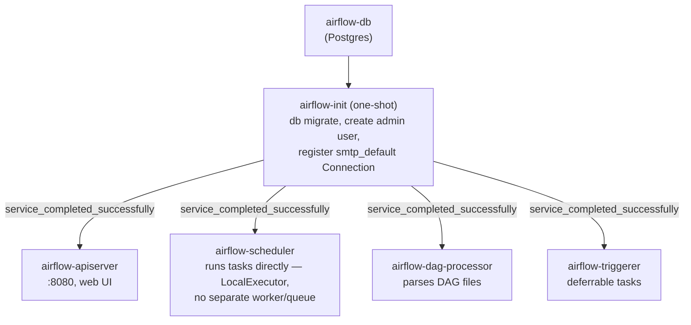

# Airflow

[← Services Reference](../../11-services-reference.md) | [Home](../../../setup.md)

---

**Purpose:** Programmatically author, schedule, and monitor workflows as Python DAGs — the industry-standard workflow orchestrator.
**Port:** `8137` (host) → `8080` (container, `airflow-apiserver`) | **Data:** `service_data/data/airflow/` (`dags/`, `logs/`, `config/`, `plugins/`) | **Requires:** Postgres

## Setup

```bash
cp services/airflow/.env.example services/airflow/.env
# generate real values for FERNET_KEY, JWT_SECRET, API_SECRET_KEY, POSTGRES_PASSWORD, _AIRFLOW_WWW_USER_PASSWORD
# set DOCKER_SOCKET_GID (needed for DockerOperator, see "DAGs can launch their own containers" below):
#   stat -c '%g' /var/run/docker.sock
mkdir -p service_data/data/airflow/dags
cp services/airflow/dags-examples/*.py service_data/data/airflow/dags/   # optional — the starter examples below
uv run homeserver.py dev up airflow
```

`services/airflow/dags-examples/` is a **git-tracked template** — `service_data/data/airflow/dags/` (bind-mounted, gitignored) is where Airflow actually reads from and where your own DAGs go. The copy step seeds your live folder with the starter examples once; after that the two are independent — edit/delete freely in `service_data/`, it never touches git, and a `git pull` on this repo never overwrites your own DAGs. This is the same relationship `.env.example`/`.env` already has, just for a whole directory instead of one file.

## First login

Browse to `https://airflow.<domain>/` (or `http://<host>:8137` in dev) and log in with `_AIRFLOW_WWW_USER_USERNAME`/`_AIRFLOW_WWW_USER_PASSWORD` from `.env`.

## Architecture — LocalExecutor, not the official CeleryExecutor default

The [official docker-compose.yaml](https://airflow.apache.org/docs/apache-airflow/stable/howto/docker-compose/index.html) ships `CeleryExecutor` by default — an 8-container setup (`postgres`, `redis`, `airflow-apiserver`, `airflow-scheduler`, `airflow-dag-processor`, `airflow-worker`, `airflow-triggerer`, `airflow-init`, plus optional `flower`) built for distributed multi-worker task execution.

This deployment uses `LocalExecutor` instead — tasks run directly inside the scheduler process, no separate task queue needed. Drops `redis`, `airflow-worker`, and `flower` entirely: 6 containers total (`airflow-db`, `airflow-init`, `airflow-apiserver`, `airflow-scheduler`, `airflow-dag-processor`, `airflow-triggerer`) instead of 8+. Airflow 3.x still requires `airflow-dag-processor` as a separate process regardless of executor (DAG parsing moved out of the scheduler for security/isolation in the 3.x rearchitecture) — it isn't Celery-specific, so it stays.

`airflow-init` is one-shot (`restart: "no"`) — runs `airflow db migrate`, creates the admin user, and registers an `smtp_default` Connection pointing at `mailpit`, then exits successfully. The other four app containers wait on `service_completed_successfully` before starting.



No `redis`/`airflow-worker`/`flower` — those only exist to support `CeleryExecutor`'s distributed task queue, which this deployment doesn't use.

`AIRFLOW__EMAIL__*` alerting is pointed at [Mailpit](../mailpit.md), a shared SMTP catcher used by other services in this stack too (not scoped to Airflow) — nothing leaves this host. See `example_email_alert_on_failure.py` below.

## Required env vars

- `FERNET_KEY` — encrypts connection passwords/variables at rest in the metadata DB. Generate: `python3 -c "import secrets, base64; print(base64.urlsafe_b64encode(secrets.token_bytes(32)).decode())"`. Rotating this after DAGs/connections exist makes existing encrypted values unreadable.
- `JWT_SECRET` (`AIRFLOW__API_AUTH__JWT_SECRET`) — internal auth between scheduler/triggerer/dag-processor and the api-server's execution API. Generate: `openssl rand -hex 32`.
- `API_SECRET_KEY` (`AIRFLOW__API__SECRET_KEY`) — web UI session/CSRF secret. This is the 3.x name; `AIRFLOW__WEBSERVER__SECRET_KEY` is the deprecated 2.x name for the same setting. Generate: `openssl rand -hex 32`.
- `AIRFLOW_UID` — host UID the containers run as; matters for who owns files under `DATA_ROOT/dags,logs,config,plugins` on the host. Image default (`50000`) is fine unless you want to directly edit DAG files as your own host user.

## Try the starter examples

Twenty-seven DAGs ship in `service_data/data/airflow/dags/`, tagged `example` in the UI. Each file's own module docstring is passed as `doc_md=__doc__`, so the full explanation below is also readable right inside the UI — DAGs list page (doc snippet under the DAG name) and each DAG's own **Details → Docs** tab — not just by opening the source file. All have `schedule=None` except `example_scheduled_with_retries`, `example_backfill`, `example_max_active_runs`, and `example_flow_control`, so trigger them manually the first time — either **DAGs list → toggle on → ▶ Trigger DAG** in the UI, or from the CLI:

```bash
docker exec airflow-scheduler airflow dags unpause example_etl_pipeline
docker exec airflow-scheduler airflow dags trigger example_etl_pipeline
# then watch it: Grid/Graph view in the UI, or (dag_id is positional, no -d flag):
docker exec airflow-scheduler airflow dags list-runs example_etl_pipeline
```

Each has its own page — description, a diagram of the actual task graph, and a `file:line` pointer into the real source:

- [`example_hello_world`](examples/example_hello_world.md) — a single task, nothing else. Start here.
- [`example_etl_pipeline`](examples/example_etl_pipeline.md) — extract → transform → load via XCom.
- [`example_branching`](examples/example_branching.md) — `BashOperator` + `BranchPythonOperator`, conditional downstream.
- [`example_parallel_tasks`](examples/example_parallel_tasks.md) — fan-out/fan-in, both `>>` and explicit dependency styles.
- [`example_scheduled_with_retries`](examples/example_scheduled_with_retries.md) — `schedule="@daily"` + retries/backoff.
- [`example_backfill`](examples/example_backfill.md) — `catchup=True`, whole-DAG-run historical reprocessing.
- [`example_max_active_runs`](examples/example_max_active_runs.md) — `max_active_runs=1`, serializes overlapping runs.
- [`example_sensor`](examples/example_sensor.md) — hand-rolled poke/reschedule sensor.
- [`example_deferrable_sensor`](examples/example_deferrable_sensor.md) — hand-rolled deferrable sensor, zero worker slot.
- [`example_file_sensor`](examples/example_file_sensor.md) — the **built-in** `FileSensor`, both modes side by side.
- [`example_cross_dag_dependencies`](examples/example_cross_dag_dependencies.md) — built-in `ExternalTaskSensor` (pull) + `TriggerDagRunOperator` (push).
- [`example_asset_triggered`](examples/example_asset_triggered.md) — Airflow's Asset (label-based cross-DAG trigger).
- [`example_dynamic_task_mapping`](examples/example_dynamic_task_mapping.md) — `.partial()`/`.expand()`, runtime-determined fan-out.
- [`example_trigger_rules`](examples/example_trigger_rules.md) — run after an upstream *failure*, not just success.
- [`example_stateful_retry`](examples/example_stateful_retry.md) — Task State Store, state surviving across retries.
- [`example_variables_and_connections`](examples/example_variables_and_connections.md) — Fernet-encrypted secrets/config store.
- [`example_email_alert_on_failure`](examples/example_email_alert_on_failure.md) — real failure email via Mailpit.
- [`example_docker_operator`](examples/example_docker_operator.md) — a task as its own resource-limited container.
- [`example_all_options`](examples/example_all_options.md) — reference: every `@dag`/`@task` option, real defaults.
- [`example_human_in_the_loop`](examples/example_human_in_the_loop.md) — built-in HITL approval gate.
- [`example_flow_control`](examples/example_flow_control.md) — `LatestOnlyOperator`, `ShortCircuitOperator`, `BranchDayOfWeekOperator`.
- [`example_object_storage_path`](examples/example_object_storage_path.md) — `ObjectStoragePath`, storage-agnostic DAG code.
- [`example_custom_notifier`](examples/example_custom_notifier.md) — a custom `BaseNotifier` subclass, reusable/templated.
- [`example_python_virtualenv_operator`](examples/example_python_virtualenv_operator.md) — a task in its own isolated venv.
- [`example_cross_service_pipeline`](examples/example_cross_service_pipeline.md) — the capstone: starts a Temporal workflow that materializes a Dagster asset.

## Reverse proxy — needs `--proxy-headers`, not just `X-Forwarded-Proto`

`airflow-apiserver`'s command is `api-server --proxy-headers`, and its environment sets `FORWARDED_ALLOW_IPS: "*"`. Without both, Airflow won't trust nginx-plain's `X-Forwarded-*` headers at all (nginx-plain is a separate container, not the same host process Airflow is watching) — redirects and CSRF checks silently build `http://` URLs even though nginx-plain already hardcodes `X-Forwarded-Proto https` upstream. This is the same class of gotcha the `homeserver-reverse-proxy` skill describes generally ("Always hardcode X-Forwarded-Proto: https") — necessary but not always sufficient; Airflow specifically also needs the proxy explicitly trusted via `--proxy-headers`/`FORWARDED_ALLOW_IPS`.

## DAGs can launch their own (resource-limited) containers

`airflow-scheduler` has `${DOCKER_SOCKET}` mounted and `apache-airflow-providers-docker` installed (via `_PIP_ADDITIONAL_REQUIREMENTS` — reinstalls on every container start, fine for one package on a homelab; the upstream docs recommend building/extending the image instead for real production use), so a DAG can use `DockerOperator` to run a task as its own container, with `mem_limit`/`cpus`/etc. passed straight to the Docker API:

```python
from airflow.providers.docker.operators.docker import DockerOperator

DockerOperator(
    task_id="run_something",
    image="some/image:tag",
    mem_limit="512m",
    cpus=1.0,
    docker_url="unix://var/run/docker.sock",
    network_mode="homeserver",  # join the homeserver bridge network, if the task needs to reach other services
)
```

See `service_data/data/airflow/dags/` for this and other worked examples (ETL task chain, branching, retries/scheduling) — dropped in place, not just documented, so they show up in the UI on first login.

Only `airflow-scheduler` has the socket — with `LocalExecutor`, that's the one container that actually runs tasks. It joins the socket's owning group via `group_add: ["${DOCKER_SOCKET_GID}"]` instead of running as root — `user: "0:0"` looks like the obvious fix (and is what dockge/portainer effectively get for free, since *their* images already default to root) but actively breaks this specific container: Apache's official image ships a guard script at `/root/bin/pip` that hard-`exit 1`s any pip invocation made as root, specifically to block `_PIP_ADDITIONAL_REQUIREMENTS` above — as root, `apache-airflow-providers-docker`/`temporalio` silently fail to install on every start and the scheduler crash-loops with no traceback. `DOCKER_SOCKET_GID` (in `.env`) isn't portable to hardcode — see `.env.example` for the one-time `stat -c '%g' /var/run/docker.sock` lookup. See `compose.yml`'s own comment for the full story (reproduced and confirmed live via `docker run --user 0:0 apache/airflow:3.3.1 pip install ...`).

## Notes

- `LOAD_EXAMPLES=false` by default — flip to `true` in `.env` for a first look at what real DAGs look like, then back to `false` to declutter (existing example DAGs stay registered either way; this only controls whether new ones get (re-)created on `airflow db migrate`).
- Health endpoint: `/api/v2/monitor/health` (the 3.x path — replaces 2.x's `/health`).
- **Admin → Configuration 403s by default** ("Your Airflow administrator chose not to expose the configuration") — set `AIRFLOW_EXPOSE_CONFIG=True` in `.env` and restart to enable it; sensitive values (passwords/secrets/keys) are still auto-masked either way. Defaults to `False` (Airflow's own secure default). Note this moved config sections between major versions — `[webserver] expose_config` in Airflow 2, `[api] expose_config` here in 3.x, since `airflow-apiserver` serves the config page now, not a separate webserver process.
- Drop your own DAG `.py` files into `service_data/data/airflow/dags/` — `airflow-dag-processor` picks them up automatically, no restart needed.
- **A custom Trigger class defined inside a DAG file needs `airflow-triggerer` to have that DAG file's directory on `PYTHONPATH`** — unlike the scheduler/dag-processor, the triggerer never parses DAG files itself, it just `import_string`s the trigger's classpath directly, so nothing puts `/opt/airflow/dags` on its `sys.path` otherwise. `compose.yml` sets `PYTHONPATH: /opt/airflow/dags` on `airflow-triggerer` for exactly this reason (bit `example_deferrable_sensor.py` during development — `ModuleNotFoundError` from inside the triggerer, not the scheduler, which is what made it non-obvious).
- **Listeners (plugin-based lifecycle hooks, e.g. every TaskInstance state change cluster-wide) are not demoed here** — worth knowing they exist, not something this repo's examples currently show. Genuinely distinct from a task's own `on_success_callback`/`on_failure_callback` (cross-DAG, not per-task), but registering one needs an actual Airflow **plugin** — a heavier setup than every other example here, which are all plain DAG files needing nothing beyond dropping them in `dags-examples/`.

---

[← Services Reference](../../11-services-reference.md) | [Home](../../../setup.md)
