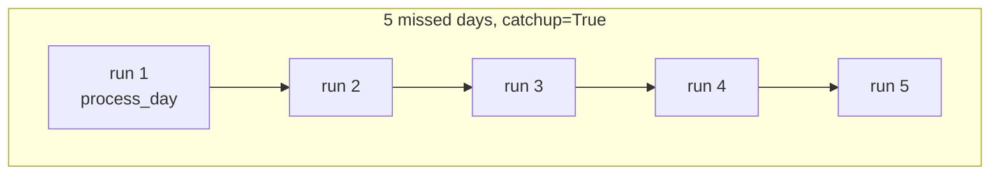

# example_backfill

[← Airflow](airflow.md) | [Home](../../../setup.md)

---

Airflow's answer to "process historical dates": `start_date` 5 days in the past + `schedule="@daily"` + `catchup=True` means unpausing creates 5 backfill runs automatically, one per missed day. Whole-DAG-run granularity — see [`docs/12-orchestration.md`](../../12-orchestration.md) for how this differs from Dagster's per-partition backfill (`daily_sales`).

📍 `services/airflow/dags-examples/example_backfill.py:28`



## Try it

```bash
docker exec airflow-scheduler airflow dags unpause example_backfill
docker exec airflow-scheduler airflow dags list-runs example_backfill
```

For an *already-running* DAG, ad hoc backfill of an arbitrary historical range (regardless of `catchup`) is a separate command:

```bash
docker exec airflow-scheduler airflow backfill create \
    --dag-id example_backfill --from-date 2026-07-01 --to-date 2026-07-05
```

---

[← Airflow](airflow.md) | [Home](../../../setup.md)
