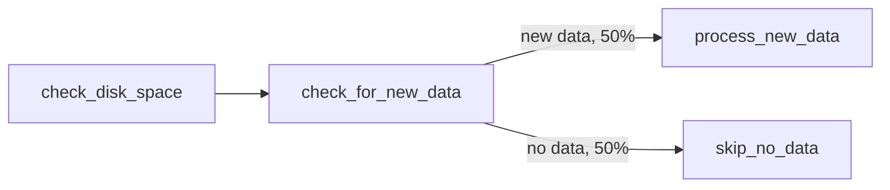

# example_branching

[← Airflow](airflow.md) | [Home](../../../setup.md)

---

`BashOperator` + `BranchPythonOperator`: run a shell command, then conditionally skip a downstream task based on a Python function's result.

📍 `services/airflow/dags-examples/example_branching.py:22`



`check_for_new_data` (`BranchPythonOperator`) returns the `task_id` string of whichever branch should run next; Airflow marks the other branch `skipped`, not just "didn't run."

## Try it

```bash
docker exec airflow-scheduler airflow dags unpause example_branching
docker exec airflow-scheduler airflow dags trigger example_branching
docker exec airflow-scheduler airflow tasks states-for-dag-run example_branching <run_id>
```

---

[← Airflow](airflow.md) | [Home](../../../setup.md)
