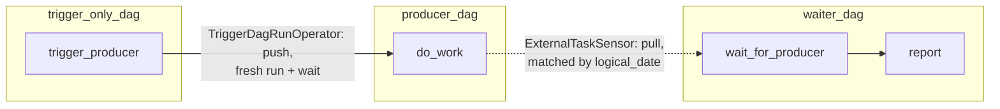

# example_cross_dag_dependencies

[← Airflow](airflow.md) | [Home](../../../setup.md)

---

Three DAGs in one file — `producer_dag` / `waiter_dag` / `trigger_only_dag` — showing Airflow's two built-in ways to make one DAG depend on another, neither needing a Sensor/Trigger you write yourself:

- **`ExternalTaskSensor`** (`waiter_dag`, the "pull" direction) — waits for a specific task in `producer_dag`'s run to reach a matching state, matched by `logical_date` by default.
- **`TriggerDagRunOperator`** (`trigger_only_dag`, the "push" direction) — actively starts a fresh `producer_dag` run and, with `wait_for_completion=True`, blocks until it finishes; the closest built-in analog to Temporal's `execute_child_workflow` or Dagster's `RunRequest`, minus their independent Event History/asset lineage.

📍 `services/airflow/dags-examples/example_cross_dag_dependencies.py:48` (`producer_dag`) / `:57` (`waiter_dag`) / `:80` (`trigger_only_dag`)



**Verified both directions:** `trigger_only_dag` completed to `success` and its push spawned a real `producer_dag` run; separately, triggering `producer_dag` and `waiter_dag` with the same explicit `--logical-date` completed `waiter_dag` to `success` once `producer_dag`'s `do_work` task matched.

## Try it

```bash
# push: TriggerDagRunOperator
docker exec airflow-scheduler airflow dags unpause trigger_only_dag
docker exec airflow-scheduler airflow dags trigger trigger_only_dag

# pull: ExternalTaskSensor — same logical_date on both triggers is what makes it match
docker exec airflow-scheduler airflow dags unpause producer_dag
docker exec airflow-scheduler airflow dags unpause waiter_dag
docker exec airflow-scheduler airflow dags trigger producer_dag --logical-date 2026-01-02T00:00:00+00:00
docker exec airflow-scheduler airflow dags trigger waiter_dag --logical-date 2026-01-02T00:00:00+00:00
```

---

[← Airflow](airflow.md) | [Home](../../../setup.md)
