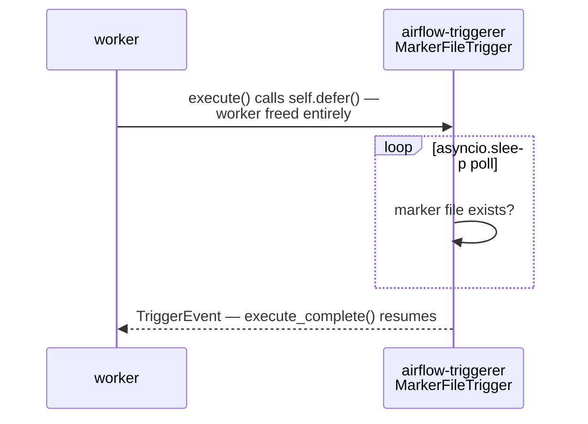

# example_deferrable_sensor

[← Airflow](airflow.md) | [Home](../../../setup.md)

---

The more efficient sibling of [`example_sensor`](example_sensor.md): a hand-rolled deferrable operator (`self.defer()` + a custom `BaseTrigger`) that suspends into `airflow-triggerer` and holds **zero** worker capacity for the entire wait, not just between polls.

Same caveat as `example_sensor`: hand-rolled to show the mechanism, not because Airflow lacks it — `FileSensor(deferrable=True)` gets you the same suspend-into-`airflow-triggerer` behavior built in; see [`example_file_sensor`](example_file_sensor.md).

📍 `services/airflow/dags-examples/example_deferrable_sensor.py:40` (`MarkerFileTrigger`) / `:68` (`WaitForMarkerFileOperator`)



**Verified:** task state shows `deferred` (not `running`) while waiting, then completes once the marker file is created.

## Try it

```bash
docker exec airflow-scheduler airflow dags unpause example_deferrable_sensor
docker exec airflow-scheduler airflow dags trigger example_deferrable_sensor
docker exec airflow-scheduler touch /opt/airflow/dags/.deferrable_sensor_trigger
```

---

[← Airflow](airflow.md) | [Home](../../../setup.md)
