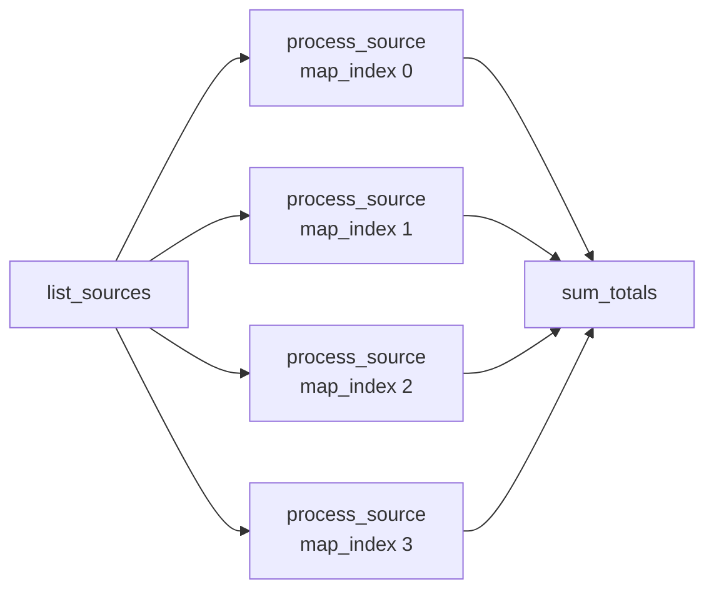

# example_dynamic_task_mapping

[← Airflow](airflow.md) | [Home](../../../setup.md)

---

`.partial()`/`.expand()`: the number of task instances is decided at runtime, not when the DAG file is parsed (a variable number of files/rows/sources, not a fixed set you wrote by hand).

📍 `services/airflow/dags-examples/example_dynamic_task_mapping.py:64`



**Verified:** `list_sources()` returns 4 items, `process_source` ran as 4 separate mapped instances (`map_index` 0–3), and `sum_totals` received their aggregated results automatically.

## Try it

```bash
docker exec airflow-scheduler airflow dags unpause example_dynamic_task_mapping
docker exec airflow-scheduler airflow dags trigger example_dynamic_task_mapping
docker exec airflow-scheduler airflow tasks states-for-dag-run example_dynamic_task_mapping <run_id>
```

---

[← Airflow](airflow.md) | [Home](../../../setup.md)
