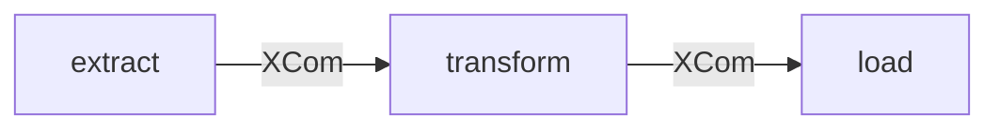

# example_etl_pipeline

[← Airflow](airflow.md) | [Home](../../../setup.md)

---

Extract → transform → load, TaskFlow (`@task`) with data passed via XCom. The "how do I chain tasks and pass data between them" starting point.

📍 `services/airflow/dags-examples/example_etl_pipeline.py:19`



## Try it

```bash
docker exec airflow-scheduler airflow dags unpause example_etl_pipeline
docker exec airflow-scheduler airflow dags trigger example_etl_pipeline
# then watch it: Grid/Graph view in the UI, or (dag_id is positional, no -d flag):
docker exec airflow-scheduler airflow dags list-runs example_etl_pipeline
```

---

[← Airflow](airflow.md) | [Home](../../../setup.md)
