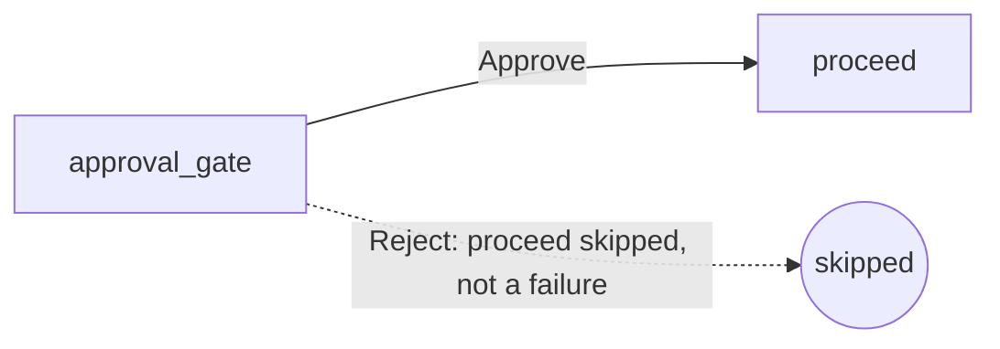

# example_human_in_the_loop

[← Airflow](airflow.md) | [Home](../../../setup.md)

---

The built-in Human-in-the-Loop (HITL, new in 3.1) `ApprovalOperator`: pause a task until a human responds via the UI's Human-in-the-loop tab or a REST API call, no Signal-handling code to write — the direct built-in parallel to Temporal's [`ApprovalWorkflow`](../temporal/ApprovalWorkflow.md).

Shows its own `awaiting_input` state (distinct from `deferred` — on Airflow 3.3+ this holds no `airflow-triggerer` slot at all, tracked directly instead). It's a gate, not a branch router: Approve lets `proceed` run, Reject **skips** it (not a failure).

📍 `services/airflow/dags-examples/example_human_in_the_loop.py:54`



**Verified both outcomes live** via the REST API (`PATCH .../hitlDetails`): approving completed `proceed` to `success`; rejecting on a second run left `approval_gate` at `success` (a human responded) with `proceed` `skipped`.

## Try it

```bash
docker exec airflow-scheduler airflow dags unpause example_human_in_the_loop
docker exec airflow-scheduler airflow dags trigger example_human_in_the_loop

# get a bearer token (same admin login the UI uses), then respond:
TOKEN=$(curl -s -X POST http://localhost:8137/auth/token \
    -H 'Content-Type: application/json' \
    -d '{"username": "admin", "password": "<_AIRFLOW_WWW_USER_PASSWORD>"}' \
    | python3 -c 'import sys,json; print(json.load(sys.stdin)["access_token"])')

RUN_ID=$(docker exec airflow-scheduler airflow dags list-runs example_human_in_the_loop \
    | tail -1 | awk -F'|' '{print $2}' | xargs)

curl -s -X PATCH \
    "http://localhost:8137/api/v2/dags/example_human_in_the_loop/dagRuns/${RUN_ID}/taskInstances/approval_gate/-1/hitlDetails" \
    -H "Authorization: Bearer ${TOKEN}" -H 'Content-Type: application/json' \
    -d '{"chosen_options": ["Approve"]}'   # or ["Reject"]
```

---

[← Airflow](airflow.md) | [Home](../../../setup.md)
