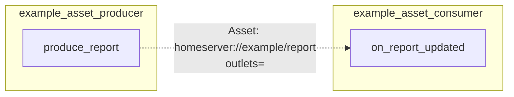

# example_asset_triggered

[← Airflow](../airflow.md) | [Home](../../../../setup.md)

---

Airflow's Asset feature (renamed from "Dataset" in 3.0): `example_asset_producer` tags a task's output with an `Asset`; `example_asset_consumer` is scheduled to run whenever that Asset updates, with no cron and no manual trigger of its own.

Not the same concept as a Dagster asset — see [`docs/12-orchestration.md`](../../../12-orchestration.md) ("Assets" means two different things here): Airflow's Asset is a *label* a task's output is tagged with, used only to trigger a different DAG — a scheduling trigger, not a data catalog.

📍 `services/airflow/dags-examples/example_asset_triggered.py:21` (`example_asset_producer`) / `:38` (`example_asset_consumer`)



## Try it

Trigger the producer once and watch the consumer run appear on its own:

```bash
docker exec airflow-scheduler airflow dags unpause example_asset_producer
docker exec airflow-scheduler airflow dags unpause example_asset_consumer
docker exec airflow-scheduler airflow dags trigger example_asset_producer
docker exec airflow-scheduler airflow dags list-runs example_asset_consumer
```

---

[← Airflow](../airflow.md) | [Home](../../../../setup.md)
