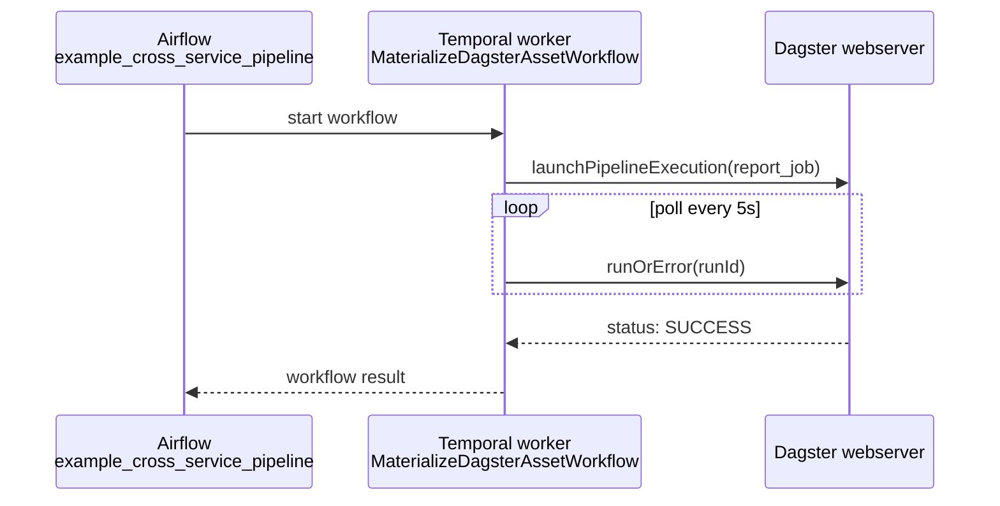

# example_cross_service_pipeline

[← Airflow](../airflow.md) | [Home](../../../../setup.md)

---

The capstone: one task starts a Temporal workflow (`temporalio` is installed on `airflow-scheduler` alongside the Docker provider — see the `compose.yml` comment) and awaits its result. That workflow durably orchestrates a Dagster job materialization via GraphQL — **Airflow schedules, Temporal durably orchestrates, Dagster materializes assets with lineage**.

See [`MaterializeDagsterAssetWorkflow`](../../temporal/examples/MaterializeDagsterAssetWorkflow.md) for the other half.

**Real-world problem:** a single business process genuinely needs a schedule, a durable multi-step workflow that survives crashes, and a data pipeline with lineage tracking — all three at once. Hand-wiring that yourself (retry logic, timeout handling, lineage bookkeeping) means reimplementing what each of these three tools already does well, and getting at least one of them subtly wrong.

📍 `services/airflow/dags-examples/example_cross_service_pipeline.py:20`



**Verified working end to end.** Full trace and sequence diagram in [`docs/12-orchestration.md`](../../../12-orchestration.md)'s "They compose" section.

## Try it

```bash
docker exec airflow-scheduler airflow dags unpause example_cross_service_pipeline
docker exec airflow-scheduler airflow dags trigger example_cross_service_pipeline
docker exec airflow-scheduler airflow dags list-runs example_cross_service_pipeline
```

---

[← Airflow](../airflow.md) | [Home](../../../../setup.md)
