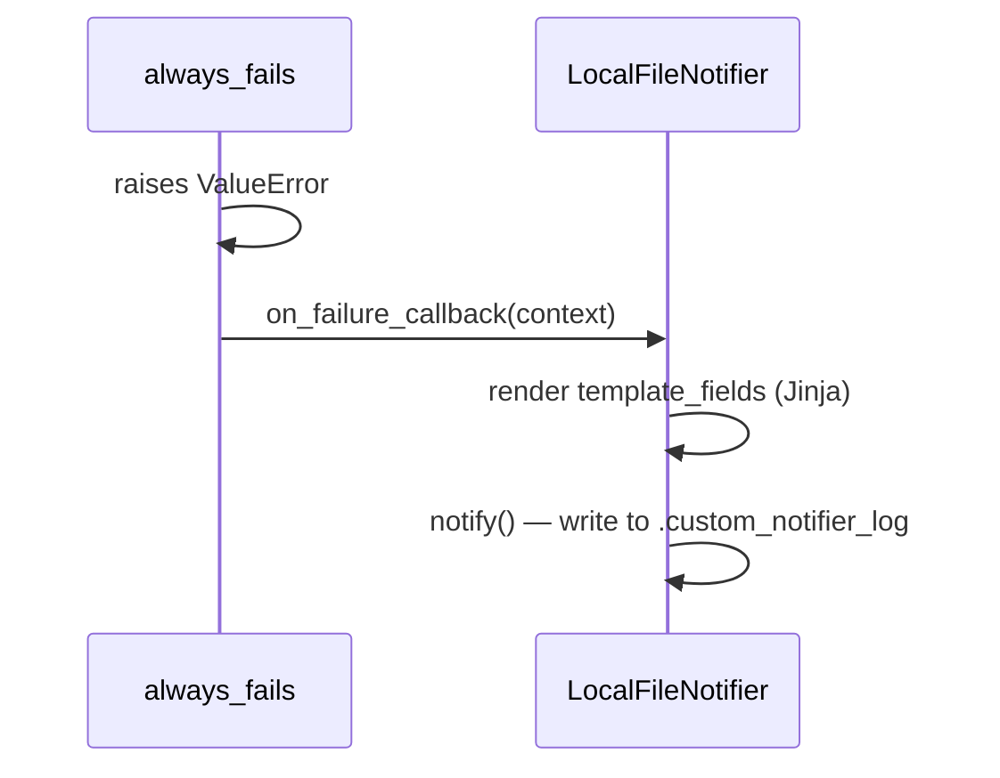

# example_custom_notifier

[← Airflow](../airflow.md) | [Home](../../../../setup.md)

---

A custom `BaseNotifier` subclass: a reusable, parameterized notification target instead of a bare `on_failure_callback` function. [`example_email_alert_on_failure`](example_email_alert_on_failure.md) already exercises a *built-in* Notifier (`SmtpNotifier`, wired up implicitly by `email_on_failure=True`) — this shows writing your own.

A plain function callback works fine for a one-off; a `BaseNotifier` subclass is worth it once the same notification target (a file, a webhook, a ticketing system) gets reused across several tasks/DAGs with different messages each time — `template_fields` makes the message itself Jinja-templatable per call, the same as any operator argument.

📍 `services/airflow/dags-examples/example_custom_notifier.py:28` (`LocalFileNotifier`) / `:52` (`on_failure_callback=`)



**Elsewhere in this stack:** Dagster's `@success_hook`/`@failure_hook` are the direct parallel — a reusable, decoratable callback attached to a job (see the [feature-parity table](../../../12-orchestration.md)). Temporal doesn't need an equivalent notifier abstraction at all: a workflow that wants to notify on failure just calls an Activity in its own `except` block (see [`OrderFulfillmentSagaWorkflow`](../../temporal/examples/OrderFulfillmentSagaWorkflow.md)'s compensation activities) — durable retries/logging come from the workflow model itself, not a separate callback registration.

**Verified:** the run failed as designed (`always_fails` always raises), and the log file shows the rendered message with real values — `ALERT: always_fails failed in example_custom_notifier` — confirming `template_fields` templating actually ran through the callback, not just literal `{{ }}` text.

## Try it

```bash
docker exec airflow-scheduler airflow dags unpause example_custom_notifier
docker exec airflow-scheduler airflow dags trigger example_custom_notifier
docker exec airflow-scheduler cat /opt/airflow/dags/.custom_notifier_log
```

---

[← Airflow](../airflow.md) | [Home](../../../../setup.md)
