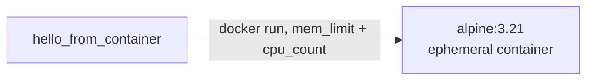

# example_docker_operator

[← Airflow](../airflow.md) | [Home](../../../../setup.md)

---

The resource-limited-container pattern — see [`airflow.md`](../airflow.md)'s "DAGs can launch their own (resource-limited) containers" section for the full mechanism (`${DOCKER_SOCKET_GID}`, why `user: "0:0"` breaks this specific container, etc.).

📍 `services/airflow/dags-examples/example_docker_operator.py:12`



## Try it

```bash
docker exec airflow-scheduler airflow dags unpause example_docker_operator
docker exec airflow-scheduler airflow dags trigger example_docker_operator
docker exec airflow-scheduler airflow dags list-runs example_docker_operator
```

---

[← Airflow](../airflow.md) | [Home](../../../../setup.md)
