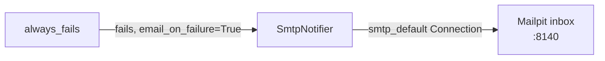

# example_email_alert_on_failure

[← Airflow](../airflow.md) | [Home](../../../../setup.md)

---

`AIRFLOW__EMAIL__DEFAULT_EMAIL_ON_FAILURE`/`ON_RETRY` (in `.env.example`) actually working, not just documented. The task always fails with `email_on_failure=True`; [Mailpit](../../mailpit.md) (shared SMTP catcher, `services/mailpit/`, web UI on `:8140`) receives it — nothing leaves this host.

**Real-world problem:** a nightly job fails at 3am and nobody notices until a user complains the next day that their dashboard is showing stale data — by the time anyone knows something broke, the fix is already a day late.

📍 `services/airflow/dags-examples/example_email_alert_on_failure.py:34`



**Verified:** the email genuinely landed in Mailpit's inbox, correct recipient, subject/body containing the real failure (`Exception: Simulated failure...`). One real gotcha this surfaced: `email_on_failure` in Airflow 3 routes through `SmtpNotifier`, which needs an actual `smtp_default` **Connection** — the classic `AIRFLOW__SMTP__*` config vars alone aren't enough and fail with `conn_id smtp_default isn't defined`; `airflow-init` now creates that connection automatically (idempotent, same pattern as the admin user). Minor cosmetic note: the `From` header shows a container-default address rather than the configured `SMTP_FROM_EMAIL` on this specific internal notification path — doesn't affect delivery or content.

## Try it

```bash
docker exec airflow-scheduler airflow dags unpause example_email_alert_on_failure
docker exec airflow-scheduler airflow dags trigger example_email_alert_on_failure
# then check Mailpit's inbox: https://mailpit.<domain>/ or http://<host>:8140
```

---

[← Airflow](../airflow.md) | [Home](../../../../setup.md)
