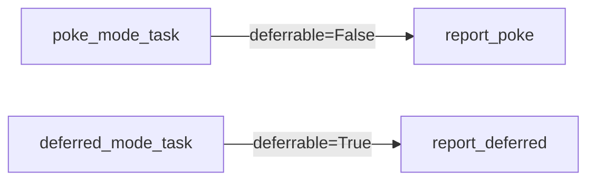

# example_file_sensor

[← Airflow](../airflow.md) | [Home](../../../../setup.md)

---

The built-in `FileSensor` (`apache-airflow-providers-standard`, already installed), both modes side by side: `poke_mode_task` (`deferrable=False`, same as [`example_sensor`](example_sensor.md)'s hand-rolled version) and `deferred_mode_task` (`deferrable=True`, same as [`example_deferrable_sensor`](example_deferrable_sensor.md)'s).

The point of this one: sensors — and the poke/reschedule/defer mechanisms behind them — are a built-in Airflow concept, not something exclusive to Dagster or requiring custom code; the other two examples hand-roll the *mechanism* for teaching, not because the feature is missing.

**Real-world problem:** a downstream step can't start until a file lands from an external system (an export job, an upload, another team's pipeline) — you need to wait for it without writing your own polling loop, and without assuming you have to reach for a heavier tool because you think Airflow can't do this natively.

📍 `services/airflow/dags-examples/example_file_sensor.py:54` (`poke_mode_task`) / `:63` (`deferred_mode_task`)



**Verified:** `poke_mode_task` showed `up_for_reschedule` between polls, `deferred_mode_task` showed `deferred` (not `running`) the whole wait, and both — plus their downstream `report_*` tasks — completed to `success` once the marker files appeared.

## Try it

Needs a one-time Connection first (`FileSensor` reads its base path from `fs_conn_id`, default `fs_default`):

```bash
docker exec airflow-scheduler airflow connections add fs_default --conn-type fs
docker exec airflow-scheduler airflow dags unpause example_file_sensor
docker exec airflow-scheduler airflow dags trigger example_file_sensor
docker exec airflow-scheduler touch /opt/airflow/dags/.file_sensor_poke_trigger /opt/airflow/dags/.file_sensor_deferred_trigger
```

---

[← Airflow](../airflow.md) | [Home](../../../../setup.md)
