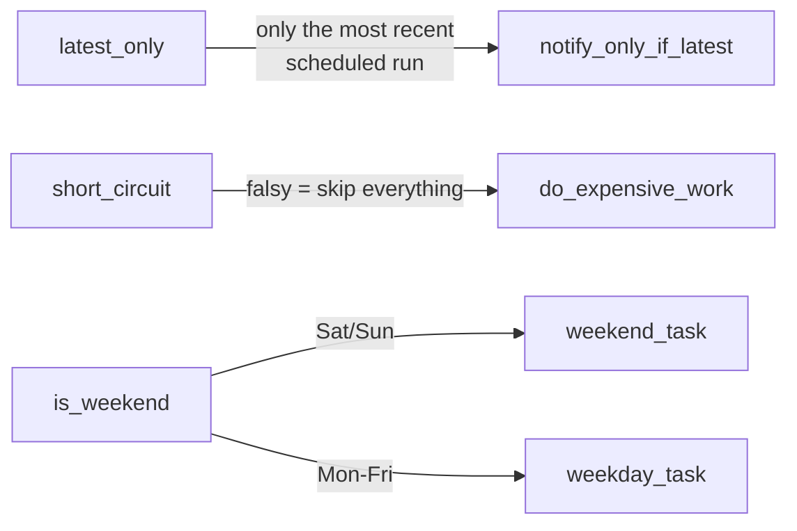

# example_flow_control

[← Airflow](../airflow.md) | [Home](../../../../setup.md)

---

Three built-in flow-control operators, distinct from [`example_branching`](example_branching.md)'s `BranchPythonOperator` and [`example_trigger_rules`](example_trigger_rules.md)'s `trigger_rule`, each independent of the other two:

- **`LatestOnlyOperator`** — skip downstream unless this run is the DAG's most recent *scheduled* run. The real-world case: don't let a backfill re-trigger a notification task. `schedule="@daily"` + `catchup=True` + a `start_date` 3 days back creates the same kind of backfill runs as [`example_backfill`](example_backfill.md).
- **`ShortCircuitOperator`** — skip *every* downstream task on a falsy return, not route between named branches like `BranchPythonOperator`.
- **`BranchDayOfWeekOperator`** — declarative day-of-week branching, no hand-written callable needed for this specific, common case.

📍 `services/airflow/dags-examples/example_flow_control.py:47` (`latest_only`) / `:62` (`short_circuit`) / `:75` (`is_weekend`)



**Elsewhere in this stack:** Dagster's parallel to `LatestOnlyOperator` is having no equivalent at all — a partitioned asset like `daily_sales` materializes exactly the partition you ask for regardless of whether it's the "current" one, so there's no analogous "skip if this is a backfill" gate to write. Temporal has no scheduling-relative concept like this either (a Workflow Execution doesn't know if it's "the latest" of anything by default) — you'd hand-roll the check yourself via a Search Attribute or external state.

**Verified:** unpausing created 3 backfill runs (`08-14`, `08-15`, `08-16`); only the most recent (`08-16`, a Sunday) reached `notify_only_if_latest` — the other two show it `skipped`. `short_circuit` passed (feature flag `True`) so `do_expensive_work` ran; `is_weekend` correctly routed to `weekend_task` (not `weekday_task`) for the Sunday run.

## Try it

```bash
docker exec airflow-scheduler airflow dags unpause example_flow_control
docker exec airflow-scheduler airflow dags list-runs example_flow_control
docker exec airflow-scheduler airflow tasks states-for-dag-run example_flow_control <run_id>
# pause again once you've watched it — it's on a daily schedule
docker exec airflow-scheduler airflow dags pause example_flow_control
```

---

[← Airflow](../airflow.md) | [Home](../../../../setup.md)
