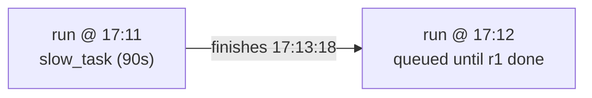

# example_max_active_runs

[← Airflow](../airflow.md) | [Home](../../../../setup.md)

---

`max_active_runs=1` caps how many runs of *this DAG* execute concurrently (scheduler default is 16). `schedule="* * * * *"` (every minute — no `@minute` preset exists) with a task that sleeps 90s means a second run is always due before the first finishes; watch it queue instead of overlapping. Contrast with `example_backfill`, which has no `max_active_runs` override and lets its 5 catchup runs execute in parallel.

📍 `services/airflow/dags-examples/example_max_active_runs.py:28`



**Verified:** the `17:11:00` run finished at `17:13:18`, and the `17:12:00` run — due a minute earlier — only started that same instant, not at its own due time, confirming it queued behind the first instead of running alongside it.

## Try it

```bash
docker exec airflow-scheduler airflow dags unpause example_max_active_runs
docker exec airflow-scheduler airflow dags list-runs example_max_active_runs
# pause again once you've watched it queue — it'll otherwise run forever, once a minute
docker exec airflow-scheduler airflow dags pause example_max_active_runs
```

---

[← Airflow](../airflow.md) | [Home](../../../../setup.md)
