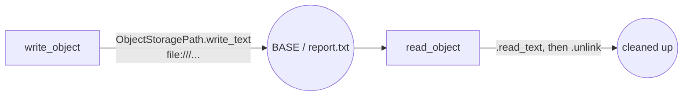

# example_object_storage_path

[← Airflow](../airflow.md) | [Home](../../../../setup.md)

---

`ObjectStoragePath` (AIP-58, since Airflow 2.8): a `pathlib.Path`-like abstraction over object stores. Not a task/scheduling primitive like most examples here — Airflow's built-in answer to "write storage-agnostic DAG code" so a DAG doesn't hardcode `boto3`/`google-cloud-storage`/raw `open()` calls tied to one specific backend.

This DAG uses the `file://` (local filesystem) backend — zero cloud credentials needed — but the exact same code, unchanged, would target `s3://`/`gs://`/`abfs://` by swapping the URI scheme and pointing at a Connection. That portability, not the local demo itself, is the point.

📍 `services/airflow/dags-examples/example_object_storage_path.py:26`



**Elsewhere in this stack:** neither Temporal nor Dagster ship a storage-agnostic path abstraction as a first-class primitive — Temporal Activities and Dagster's I/O managers both just use whatever client library you bring (`boto3`, `google-cloud-storage`, etc.) directly inside your own code. Dagster's I/O managers are the closest conceptual relative (an abstraction over *where an asset's output lives*, see `report_pipeline`'s `FilesystemIOManager`), but that's a pluggable storage backend for asset outputs specifically, not a general-purpose path object you can use anywhere in your code the way `ObjectStoragePath` is.

## Try it

```bash
docker exec airflow-scheduler airflow dags unpause example_object_storage_path
docker exec airflow-scheduler airflow dags trigger example_object_storage_path
```

**Verified:** ran to `success` — wrote, read back, and cleaned up a file entirely through `ObjectStoragePath`.

---

[← Airflow](../airflow.md) | [Home](../../../../setup.md)
