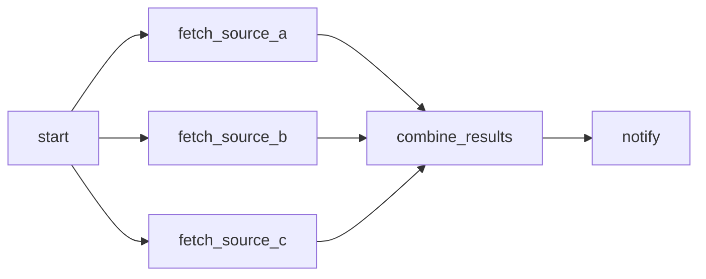

# example_parallel_tasks

[← Airflow](../airflow.md) | [Home](../../../../setup.md)

---

Fan-out to 3 independent tasks that run concurrently under `LocalExecutor`, then fan-in to a task that waits for all of them before running, then one more downstream of that. Shows both dependency-declaration styles: the `>>` shorthand used everywhere else in these examples, and the explicit `.set_downstream()`/`.set_upstream()` method calls it's shorthand for.

📍 `services/airflow/dags-examples/example_parallel_tasks.py:64`



**Verified:** the 3 parallel tasks' start times overlap by design (check with `airflow tasks states-for-dag-run example_parallel_tasks <run_id>`), and `combine_results`/`notify` only start once every upstream task has succeeded.

## Try it

```bash
docker exec airflow-scheduler airflow dags unpause example_parallel_tasks
docker exec airflow-scheduler airflow dags trigger example_parallel_tasks
docker exec airflow-scheduler airflow tasks states-for-dag-run example_parallel_tasks <run_id>
```

---

[← Airflow](../airflow.md) | [Home](../../../../setup.md)
