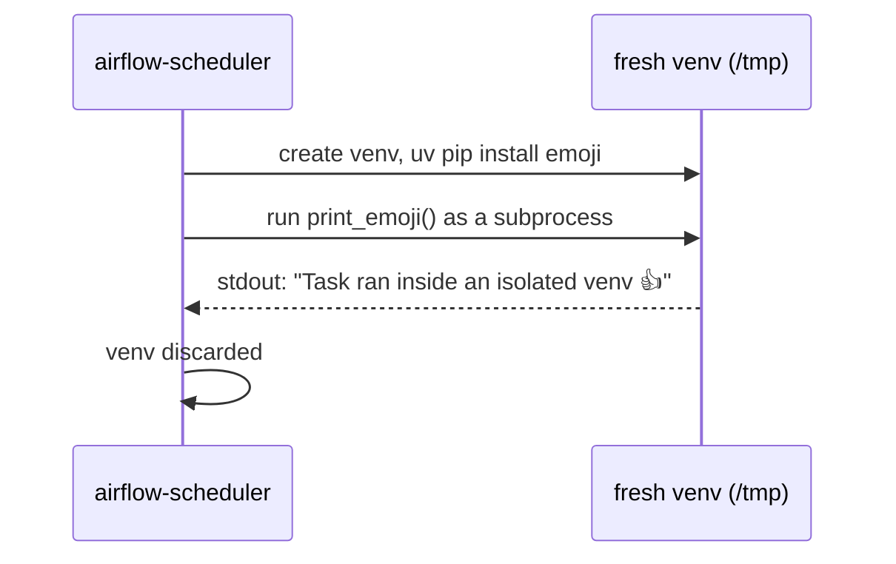

# example_python_virtualenv_operator

[← Airflow](../airflow.md) | [Home](../../../../setup.md)

---

`PythonVirtualenvOperator`: runs a callable inside a fresh, isolated venv with its own `requirements`, instead of whatever's already installed in `airflow-scheduler`'s own environment. Real fit: one task needs a specific/conflicting package version the rest of the DAG doesn't, without touching `_PIP_ADDITIONAL_REQUIREMENTS` (which installs into the scheduler's environment for *every* task) or building a dedicated custom image.

Honest limitation, not glossed over: this rebuilds the venv **every run** unless `venv_cache_path` is set (not set here, for simplicity) — fine for a homelab's occasional task, a real production cost at high task-run volume. `system_site_packages=False` means the callable genuinely can't see Airflow's own installed packages either — only what's listed in `requirements`, plus the stdlib.

**Real-world problem:** one task needs a package version that conflicts with what the rest of your DAGs already depend on — upgrading the scheduler's shared environment just for that one task's sake risks breaking every other DAG relying on the older version.

📍 `services/airflow/dags-examples/example_python_virtualenv_operator.py:41`



**Elsewhere in this stack:** Dagster's closest analog is running an asset/op's *step* in its own Docker container via `docker_executor` (see [`report_pipeline`](../../dagster/examples/report_pipeline.md)) — heavier isolation (a whole container, not just a venv) but the same underlying motivation of not making every task share one environment. Temporal doesn't have an equivalent at all: an Activity always runs in whatever environment the Worker process itself was started with — dependency isolation there means running a *separate Worker process* (a different container/deployment) for activities needing different dependencies, not a per-call sandbox.

**Verified live:** `uv pip install --python /tmp/venvXXXX/bin/python -r requirements.txt` installed `emoji==2.15.0` in under 100ms, and the callable's real output (`Task ran inside an isolated venv 👍`) appeared in the task log — confirmed genuinely isolated execution, not a no-op. (One harmless cosmetic warning in the logs — `Fail to delete /opt/airflow/tmp/venvXXXX. The directory does not exist` — a path mismatch in this Airflow version's cleanup step; doesn't affect correctness, the venv itself is created/used/removed from `/tmp` correctly.)

## Try it

```bash
docker exec airflow-scheduler airflow dags unpause example_python_virtualenv_operator
docker exec airflow-scheduler airflow dags trigger example_python_virtualenv_operator
```

---

[← Airflow](../airflow.md) | [Home](../../../../setup.md)
