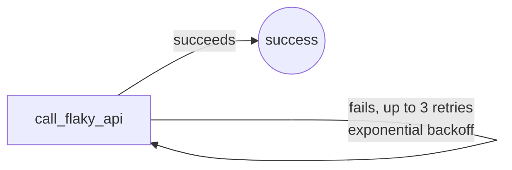

# example_scheduled_with_retries

[← Airflow](../airflow.md) | [Home](../../../../setup.md)

---

A daily-scheduled DAG (`schedule="@daily"`, runs on its own, no manual trigger needed) with `retries`/`retry_delay`/backoff configured — the two things almost every real production DAG needs.

**Real-world problem:** a third-party API you depend on is flaky maybe 1 time in 20 — without automatic retries, a single blip fails your whole nightly pipeline and someone has to notice and re-run it by hand before anyone downstream sees fresh data.

📍 `services/airflow/dags-examples/example_scheduled_with_retries.py:18`



## Try it

Runs on its own daily — to see it now:

```bash
docker exec airflow-scheduler airflow dags unpause example_scheduled_with_retries
docker exec airflow-scheduler airflow dags trigger example_scheduled_with_retries
docker exec airflow-scheduler airflow dags list-runs example_scheduled_with_retries
```

---

[← Airflow](../airflow.md) | [Home](../../../../setup.md)
