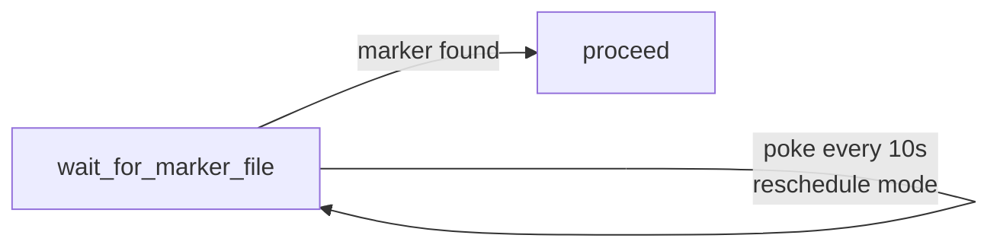

# example_sensor

[← Airflow](../airflow.md) | [Home](../../../../setup.md)

---

`@task.sensor` polling for a marker file (`service_data/data/airflow/dags/.sensor_trigger`) every 10s in `reschedule` mode (frees the worker slot between polls instead of blocking it).

Hand-rolled deliberately, to make the poke/reschedule mechanism itself visible — Airflow ships a real `FileSensor` that does this exact job in a couple lines; see [`example_file_sensor`](example_file_sensor.md) for the built-in version side by side.

📍 `services/airflow/dags-examples/example_sensor.py:32`



## Try it

```bash
docker exec airflow-scheduler airflow dags unpause example_sensor
docker exec airflow-scheduler airflow dags trigger example_sensor
# from another terminal, once it's running:
docker exec airflow-scheduler touch /opt/airflow/dags/.sensor_trigger
```

---

[← Airflow](../airflow.md) | [Home](../../../../setup.md)
