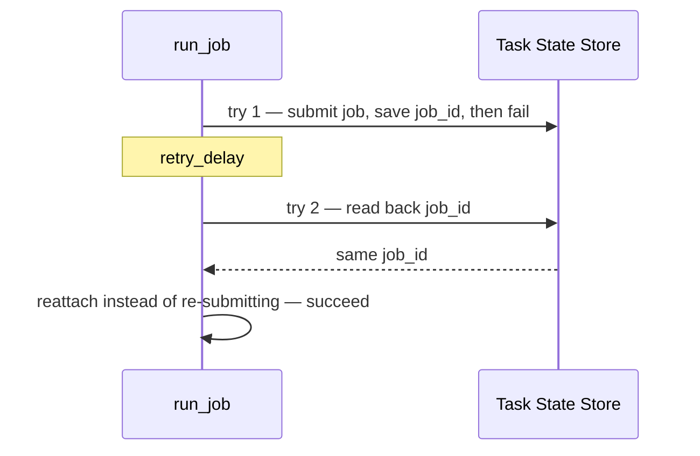

# example_stateful_retry

[← Airflow](../airflow.md) | [Home](../../../../setup.md)

---

The Task State Store (AIP-103, new in Airflow 3.3): a task persists key-value state that survives across *retries* of that same task, not just between different tasks in a run like XCom does. The task always fails right after "submitting" a job on try 1.

📍 `services/airflow/dags-examples/example_stateful_retry.py:51`



**Verified:** try 2 read back the identical `job_id` and reattached instead of submitting a duplicate (`Try 1: submitted job: job-tabkx0z8` → `Try 2: reattaching to existing job: job-tabkx0z8`).

## Try it

```bash
docker exec airflow-scheduler airflow dags unpause example_stateful_retry
docker exec airflow-scheduler airflow dags trigger example_stateful_retry
docker exec airflow-scheduler airflow tasks states-for-dag-run example_stateful_retry <run_id>
# then read the job_id lines in the UI's Grid view -> run_job -> try 1 / try 2 -> Logs
```

---

[← Airflow](../airflow.md) | [Home](../../../../setup.md)
