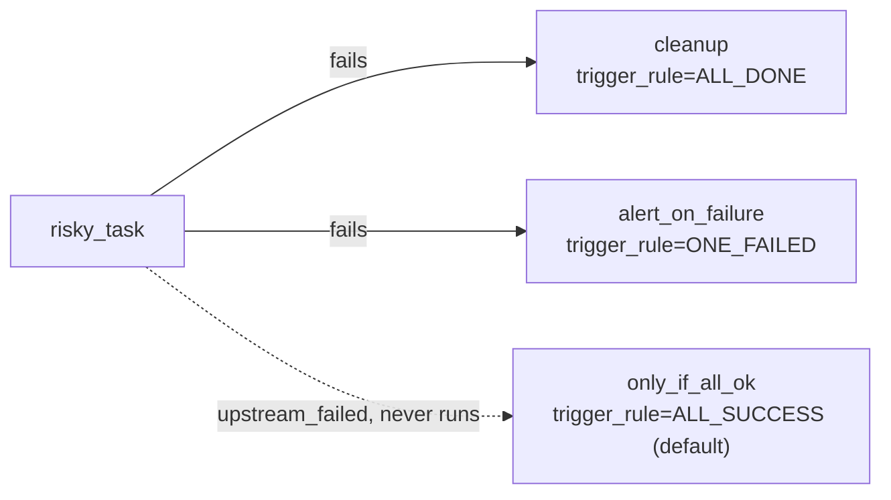

# example_trigger_rules

[← Airflow](../airflow.md) | [Home](../../../../setup.md)

---

`trigger_rule` controls whether a task runs after an upstream *failure*, not just success (every other example here uses the implicit `all_success` default). `risky_task` always fails; `cleanup` (`ALL_DONE`) and `alert_on_failure` (`ONE_FAILED`) run anyway.

**Real-world problem:** cleanup — releasing a lock, closing a connection, deleting a temp file — needs to happen whether a step succeeded or failed. Airflow's default behavior is to skip every downstream task the moment anything upstream fails, which would skip your cleanup exactly when it's needed most.

📍 `services/airflow/dags-examples/example_trigger_rules.py:31`



**Verified:** both `cleanup` and `alert_on_failure` succeeded specifically because the upstream failed, while `only_if_all_ok` (default rule) correctly never ran (`upstream_failed`).

## Try it

```bash
docker exec airflow-scheduler airflow dags unpause example_trigger_rules
docker exec airflow-scheduler airflow dags trigger example_trigger_rules
docker exec airflow-scheduler airflow tasks states-for-dag-run example_trigger_rules <run_id>
```

---

[← Airflow](../airflow.md) | [Home](../../../../setup.md)
