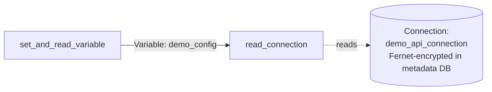

# example_variables_and_connections

[← Airflow](../airflow.md) | [Home](../../../../setup.md)

---

Airflow's own lightweight, Fernet-encrypted secrets/config store (Variables + Connections), no external secrets manager needed at homelab scale.

**Real-world problem:** every pipeline needs credentials somewhere — hardcoding an API key straight into DAG source that gets committed to git, or scattering plaintext values across `.env` files, is neither safe nor manageable once more than one person is touching the codebase.

📍 `services/airflow/dags-examples/example_variables_and_connections.py:32`



**Verified:** read back the Variable correctly, resolved the Connection's host/login with the password properly masked in logs, and confirmed directly against the metadata DB that the stored password is a real Fernet token (`gAAAAAB...`), not plaintext.

## Try it

Needs a one-time Connection first:

```bash
docker exec airflow-scheduler airflow connections add demo_api_connection \
    --conn-type http --conn-host api.example.com --conn-login demo_user --conn-password super-secret-value

docker exec airflow-scheduler airflow dags unpause example_variables_and_connections
docker exec airflow-scheduler airflow dags trigger example_variables_and_connections
```

Prove it's genuinely encrypted, not plaintext, straight from the DB:

```bash
docker exec airflow-db psql -U airflow -c "SELECT conn_id, password FROM connection WHERE conn_id='demo_api_connection';"
```

---

[← Airflow](../airflow.md) | [Home](../../../../setup.md)
