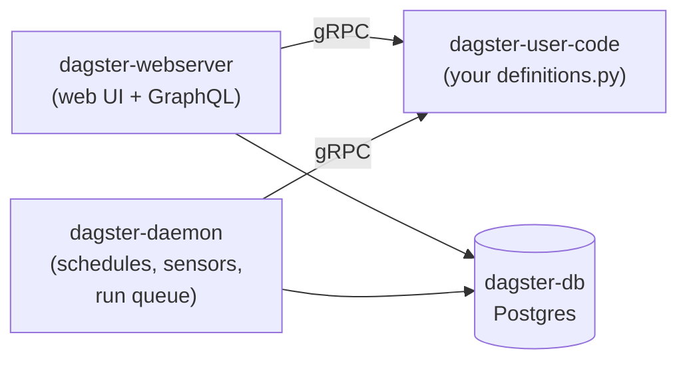
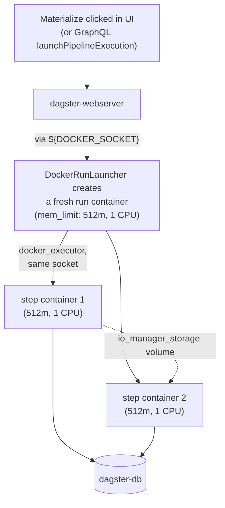

# Dagster

[← Services Reference](../../11-services-reference.md) | [Home](../../../setup.md)

---

**Purpose:** Data orchestrator built around software-defined assets — track lineage, materialize pipelines, and observe data quality.
**Port:** `8139` (host) → `3000` (container, `dagster-webserver`) | **Data:** DB in a named volume; no `DATA_ROOT`-scoped app data | **Requires:** Postgres

## Setup

```bash
cp services/dagster/.env.example services/dagster/.env
# set DAGSTER_POSTGRES_PASSWORD
uv run homeserver.py dev up dagster
```

`dagster-user-code` seeds its own live code directory
(`service_data/data/dagster/user-code/`) with `definitions.py` on its
first-ever start — no manual copy needed, and Docker auto-creates the
directory itself if `service_data/data/dagster/user-code/` doesn't exist
yet. See "Where your pipeline code actually lives" below for the
mechanism.

Open `https://dagster.<domain>/` (or `http://<host>:8139` in dev) — no login/setup wizard, the UI is open to anyone who can reach it (see Notes).

**Health endpoint:** `dagster-webserver`'s own `compose.yml` healthcheck hits `GET /server_info` (port `3000` internally, `8139` on the dev host port) via `python3 -c "import urllib.request; ..."` rather than `curl` — `python:3.13-slim` doesn't ship `curl`, and adding a package just for the healthcheck wasn't worth it. `dagster-db` uses a plain `pg_isready` check instead, since it's Postgres.

## Architecture — no official pre-built webserver/daemon image, unlike Airflow or Temporal

Dagster's self-hosted webserver+daemon aren't published as ready-to-run images — every other service in this stack runs from a published image with only config layered on top; Dagster's own [official Docker example](https://docs.dagster.io/deployment/oss/deployment-options/docker) builds them from a small Dockerfile instead (`pip install dagster dagster-webserver dagster-postgres dagster-docker` on a slim Python base). This deployment does the same shape on `python:3.14-slim`, but with dependencies declared in `pyproject.toml` and installed via `uv sync --locked` against a committed `uv.lock` instead of a bare `pip install` — `services/dagster/webserver-daemon/Dockerfile`, shared by both `dagster-webserver` and `dagster-daemon` (same package set, different entrypoint command).

**`dagster-user-code` is the reason this can't be a plain image at all** — it's the gRPC server exposing your actual pipeline code, and "your actual pipeline code" doesn't exist as a generic Docker Hub image by definition. See "Where your pipeline code actually lives" below for where `definitions.py` really is and why.

4 containers total: `dagster-db`, `dagster-user-code`, `dagster-webserver`, `dagster-daemon` (plus two named volumes: Postgres data and `io_manager_storage`, the default filesystem I/O manager's shared scratch space between the run-launcher container and whatever step container reads its output).



## Where your pipeline code actually lives

`services/dagster/user-code/definitions.py` is a **git-tracked template**, not what actually runs — the container reads live code from a bind mount: `service_data/data/dagster/user-code/` (gitignored, your live copy). The template is also baked into the built image at `/template`, purely as a seed source; `dagster-user-code`'s entrypoint copies it into the bind mount **only when `definitions.py` is missing there** (fresh clone, restored backup), then execs the gRPC server. After that first copy, the two are independent — edit freely in `service_data/`, it never touches git, and a `git pull` on this repo never overwrites your own pipeline. Same relationship as `.env.example`/`.env`, just for a whole file instead of a few variables.

`definitions.py` is the container's actual entrypoint argument, not decoration — deleting it entirely just gets it re-seeded from the template on the next restart rather than leaving the container permanently unable to start a code location at all.

The check and copy both live in `user-code/Dockerfile`'s `CMD`, not in `compose.yml` or `homeserver.py` — it runs fresh on every container start, not just the first:

```dockerfile
CMD ["/bin/sh", "-c", "[ -f definitions.py ] || cp /template/definitions.py .; exec dagster api grpc -h 0.0.0.0 -p 4000 -f definitions.py"]
```

Same shape as Temporal's worker (see its own doc for the full breakdown): `[ -f definitions.py ]` tests whether the file already exists in `/opt/dagster/app` (the bind mount, set as `WORKDIR`); `||` runs the `cp` only when that test fails; `;` then unconditionally starts the code server either way. `exec` hands off the process in place so `dagster` itself becomes PID 1 and receives Docker's shutdown signal directly, instead of a wrapping shell swallowing it.

Changing `definitions.py` only needs a restart, not a rebuild:

```bash
docker restart dagster-user-code
```

(Dagster's docker-compose deployment doesn't auto-reload on file change — restarting is the documented way to pick up code changes; see [dagster-io/dagster#30824](https://github.com/dagster-io/dagster/issues/30824).)

**Every run and step container launched by `DockerRunLauncher`/`docker_executor` also needs this same mount** — they run the identical `homeserver/dagster-user-code` image, and since that image no longer bakes in `definitions.py`, a run/step container can't import the code it's supposed to execute without it. That's why the bind mount appears **three places**, all pointing at the same host path: `dagster-user-code`'s own `compose.yml` volume (uses `${DATA_ROOT}`), plus `dagster.yaml`'s `run_launcher.container_kwargs.volumes` and `definitions.py`'s own `docker_executor` `container_kwargs.volumes` (both hardcoded to the absolute host path, since `dagster.yaml` is baked into the image at build time — not compose-interpolated, so `${DATA_ROOT}` doesn't work there). Update all three if `service_data/` ever moves.

## Every run — and every step — launches as its own container, by default

This isn't an optional executor choice bolted on afterward — it's Dagster's own official `docker-compose` example's default configuration, carried over here: `dagster.yaml`'s `run_launcher` is `DockerRunLauncher` (every **run** gets its own container, via `dagster-webserver`/`dagster-daemon`'s mounted `${DOCKER_SOCKET}`), and `definitions.py`'s `docker_executor` additionally runs every **step within** a run as its own container. Both have `container_kwargs`/config caps (`mem_limit: 512m`, `nano_cpus: 1_000_000_000` — 1 CPU) so a run's actual resource footprint is bounded and explicit, the same pattern as Airflow's `DockerOperator` and Temporal's worker (see their own docs). Raise `webserver-daemon/dagster.yaml`'s copy if a *run launch* needs more (rebuild `dagster-webserver`+`dagster-daemon`, since that file is baked into their shared image); raise `definitions.py`'s copy in `service_data/data/dagster/user-code/` if a *step* needs more (just restart `dagster-user-code`, no rebuild — see "Where your pipeline code actually lives" above).



Every box on the right is short-lived — created for one run or one step, then removed — unlike the 4 long-running containers above.

## Try the starter examples

Open the UI's **Assets** tab to browse everything below live. Easiest way to run anything is the UI (select assets → **Materialize selected**, or a job → **Launchpad** → **Launch Run**) — each materialization/run launches as its own container per the section above, watch it happen with `docker ps` in another terminal while it runs.

Each asset/job grouping has its own page — description, a diagram, a `file:line` pointer into the real source, and the GraphQL call to run it:

- [`hello_homeserver`](examples/hello_homeserver.md) — the simplest possible asset. Start here.
- [`report_pipeline`](examples/report_pipeline.md) — `raw_data` → `cleaned_data` → `report`, lineage inferred from parameter names; `report_job` + `report_daily_schedule` for the scheduling side.
- [`report_freshness_check`](examples/report_freshness_check.md) — an Asset Check, Dagster's built-in data-quality concept.
- [`report_notification`](examples/report_notification.md) — Declarative Automation, a third scheduling paradigm.
- [`daily_sales`](examples/daily_sales.md) — a `DailyPartitionsDefinition`-partitioned asset, per-partition backfill.
- [`marker_file_sensor`](examples/marker_file_sensor.md) — Dagster's parallel to Airflow's Sensor.
- [`source_system_summary`](examples/source_system_summary.md) — a `ConfigurableResource`, dependency injection not lineage.
- [`orders_multi_asset`](examples/orders_multi_asset.md) — `@multi_asset`, several assets from one materialization.
- [`customer_orders`](examples/customer_orders.md) — the "catalog" side: description/owners/kinds/column-schema metadata.
- [`ops_pipeline_job`](examples/ops_pipeline_job.md) — the classic `@op`/`@job` style, compared against assets.
- [`reference_asset`](examples/reference_asset.md) — reference: every `@asset`/`@op`/`@job`/`ScheduleDefinition`/`@sensor` option.
- [`flaky_retry_asset`](examples/flaky_retry_asset.md) — `retry_policy` actually retrying, live, across fresh step containers.
- [`fan_out`](examples/fan_out.md) — 3 independent assets materializing concurrently, verified via timestamps.
- [`daily_sales_single_run`](examples/daily_sales_single_run.md) — `BackfillPolicy.single_run()`, one run for a whole partition range.
- [`log_job_success`](examples/log_job_success.md) — a `@success_hook`, Dagster's parallel to a custom Notifier.
- [`process_uploaded_file`](examples/process_uploaded_file.md) — `DynamicPartitionsDefinition`, partitions created at runtime.

From the CLI, `dagster asset materialize -f definitions.py` (the form Dagster's own docs lead with) only works run *locally against a file*, which doesn't apply here (nothing under `/opt/dagster/app` on `dagster-webserver` — `dagster-user-code` is the only container with `definitions.py` mounted, and it has no Docker socket to launch anything with). Target the already-deployed workspace over GraphQL instead — the same thing the UI's Materialize button does internally:

```bash
docker exec dagster-webserver dagster-graphql -r http://localhost:3000 -p launchPipelineExecution -v '{
  "executionParams": {
    "selector": {"repositoryLocationName": "user_code", "repositoryName": "__repository__", "pipelineName": "report_job"},
    "mode": "default"
  }
}'
```

Dagster 1.13 also added partitioned Asset Checks (a check scoped to one partition instead of the whole asset), deliberately **not** included here — it requires `partitions_def` on an `AssetCheckSpec`, which Dagster itself flags with a `PreviewWarning` ("not considered ready for production use"), the same preview-status concern as the newer virtual-assets feature. Worth knowing it exists once it's stable; not included as a starter example while it isn't.

`report_job` is also the target of the cross-service capstone example: Temporal's `MaterializeDagsterAssetWorkflow` launches it via this same GraphQL API and durably waits for it, triggered on a schedule by Airflow's `example_cross_service_pipeline` DAG — **Airflow schedules, Temporal durably orchestrates, Dagster materializes assets with lineage**. See `docs/services/temporal/temporal.md` for the workflow side; verified working end to end.

## Resource caps on the platform's own containers

Separately from the per-run/per-step caps above, the 4 platform containers themselves have `deploy.resources.limits.memory` caps: `dagster-db` 512M, `dagster-user-code` 256M (just serves gRPC, lightweight), `dagster-webserver` 512M, `dagster-daemon` 384M — conservative starting points, same reasoning as Temporal's (see `docs/services/temporal/temporal.md`'s "Resource caps" section).

## Notes

- **No built-in auth on the UI** — same situation as Temporal (see `docs/services/temporal/temporal.md`'s Notes): RBAC/SSO is a Dagster+ (paid) feature, not available in open-source Dagster. **Gated behind Authentik forward-auth instead** — `dagster.${DOMAIN}` requires an Authentik login at the nginx layer before any request reaches the container. See [Forward-auth for other services](../authentik.md#forward-auth-for-other-services-nginx-auth_request) in `authentik.md`.
- `docker_executor`/`DockerRunLauncher` (the container-per-run/per-step mechanism everything here relies on for resource limits) is a **beta** API per Dagster's own docs — stable enough to build on, but Dagster reserves the right to make breaking changes in a minor version bump, unlike the fully-stable core APIs (`@asset`, `Definitions`, etc.). Worth knowing before pinning a much newer Dagster version later without re-checking this specifically.
- Elasticsearch/advanced search isn't deployed — Postgres-backed run/schedule/event-log storage covers normal usage fine.
- `DAGSTER_CURRENT_IMAGE` on `dagster-user-code` must match that service's own `image:` tag in `compose.yml` — it's how the run launcher knows which image to use when it launches a new run container. If you ever rename the image tag, update both places together.
- **`pool=` concurrency pools are documented (`reference_asset`/`reference_op`) but not demoed live** — see the [feature-parity table](../../12-orchestration.md)'s "Capping concurrent executions" row for why: it needs a `dagster.yaml` `concurrency:` block, baked into the shared `dagster-webserver`/`dagster-daemon` image at build time, so demoing it means editing that file and rebuilding both containers — not a `definitions.py`-only change like every other example here.
- **Asset Observations (`@observable_source_asset`/`ObserveResult`) are not demoed here** — a distinct concept from materialization: recording that a *source* asset (data Dagster doesn't produce, e.g. an external table) was checked/is fresh, without computing anything. None of this repo's examples touch source assets at all; worth knowing the concept exists for a real external-freshness use case.

---

[← Services Reference](../../11-services-reference.md) | [Home](../../../setup.md)
