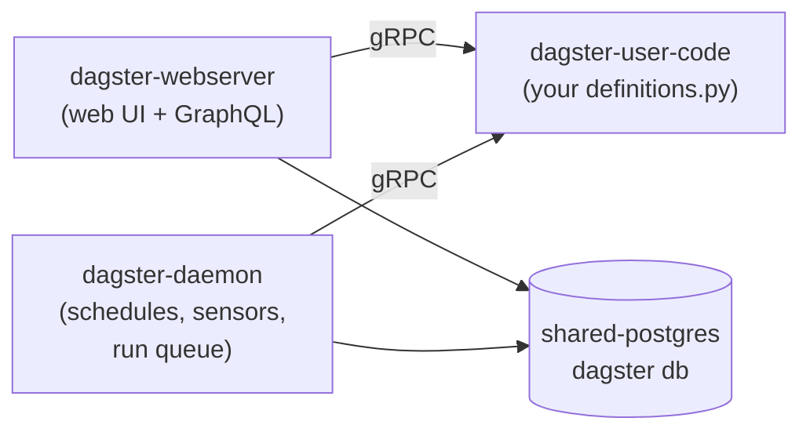
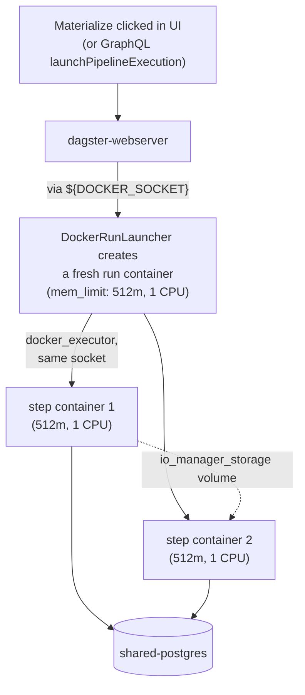

# Dagster

[← Services Reference](../../11-services-reference.md) | [Home](../../../setup.md)

---

**Purpose:** Data orchestrator built around software-defined assets — track lineage, materialize pipelines, and observe data quality.
**Port:** `8139` (host) → `3000` (container, `dagster-webserver`) | **Data:** DB in a named volume; no `DATA_ROOT`-scoped app data | **Requires:** Postgres

**Database:** on the shared Postgres server ([shared-postgres](../shared-postgres.md)), not its own container — since 2026-10-01. `homeserver.py` starts `shared-postgres` before this service and creates its database and login from `DAGSTER_POSTGRES_DB`, `DAGSTER_POSTGRES_USER`, `DAGSTER_POSTGRES_PASSWORD` in `services/dagster/.env` (the `shared_db` entry in `services.json`); snapshots include a dump of just this service's database.


## Setup

```bash
cp services/dagster/.env.example services/dagster/.env
# set DAGSTER_POSTGRES_PASSWORD
uv run homeserver.py dev up dagster
```

`dagster-user-code` seeds its own live code directory
(`service_data/data/dagster/user-code/`) with `definitions.py` on its
first-ever start — no manual copy needed, and Docker auto-creates the
directory itself if `service_data/data/dagster/user-code/` doesn't exist
yet. See "Where your pipeline code actually lives" below for the
mechanism.

Open `https://dagster.<domain>/` (or `http://<host>:8139` in dev) — no login/setup wizard, the UI is open to anyone who can reach it (see Notes).

**Healthchecks:** `dagster-user-code` runs `dagster api grpc-health-check -p 4000`. `dagster-daemon` runs `dagster-daemon liveness-check` at 120s interval / 60s timeout / 2 retries: it reads heartbeats from Postgres and is slow, and those are the commonly used timings. All three Dagster containers set `init: true` (2026-10-02, verified healthy on a fresh install). **Health endpoint:** `dagster-webserver`'s own `compose.yml` healthcheck hits `GET /server_info` (port `3000` internally, `8139` on the dev host port) via `python3 -c "import urllib.request; ..."` rather than `curl` — `python:3.14-slim` (the base in both Dockerfiles) doesn't ship `curl`, and adding a package just for the healthcheck wasn't worth it. The database's readiness is covered by `shared-postgres`'s own `pg_isready` check, which `homeserver.py` waits on before starting Dagster.

## Architecture — no official pre-built webserver/daemon image, unlike Airflow or Temporal

Dagster's self-hosted webserver+daemon aren't published as ready-to-run images — every other service in this stack runs from a published image with only config layered on top; Dagster's own [official Docker example](https://docs.dagster.io/deployment/oss/deployment-options/docker) builds them from a small Dockerfile instead (`pip install dagster dagster-webserver dagster-postgres dagster-docker` on a slim Python base). This deployment does the same shape on `python:3.14-slim`, but with dependencies declared in `pyproject.toml` and installed via `uv sync --locked` against a committed `uv.lock` instead of a bare `pip install` — `services/dagster/webserver-daemon/Dockerfile`, shared by both `dagster-webserver` and `dagster-daemon` (same package set, different entrypoint command).

**`dagster-user-code` is the reason this can't be a plain image at all** — it's the gRPC server exposing your actual pipeline code, and "your actual pipeline code" doesn't exist as a generic Docker Hub image by definition. See "Where your pipeline code actually lives" below for where `definitions.py` really is and why.

3 containers total: `dagster-user-code`, `dagster-webserver`, `dagster-daemon`, with run/event storage on `shared-postgres` (`dagster.yaml`'s `hostname: shared-postgres`, baked into the image, so rebuild it after changing that file), plus the `io_manager_storage` named volume, the default filesystem I/O manager's shared scratch space between the run-launcher container and whatever step container reads its output).


```mermaid
flowchart LR
    UI["dagster-webserver<br/>(web UI + GraphQL)"] -->|gRPC| UC["dagster-user-code<br/>(your definitions.py)"]
    Daemon["dagster-daemon<br/>(schedules, sensors,<br/>run queue)"] -->|gRPC| UC
    UI --> DB[("shared-postgres<br/>dagster db")]
    Daemon --> DB
```

## Where your pipeline code lives

**In the image** (since 2026-10-04). `services/dagster/user-code/definitions.py` is built into `homeserver/dagster-user-code` (`user-code/Dockerfile`: `COPY definitions.py /opt/dagster/app/`). Compose and Kubernetes run that same image, and every run and step container uses it too, so the code needs no mount anywhere. That's Dagster's documented way for Kubernetes and for Dagster+ code locations.

To change a pipeline, edit `user-code/definitions.py` and rebuild:

```bash
uv run homeserver.py dev update dagster      # rebuilds the image and restarts
```

**Before 2026-10-04** the code ran from an editable copy under `service_data/data/dagster/user-code/`, seeded from the template on first start. That copy matched the template exactly when this changed, so nothing was lost. The folder is left in place, unused.

**How a run's steps execute** is the runtime's choice (`DAGSTER_EXECUTOR` in `.env`, read by `definitions.py`), so the same code runs on both:

| `DAGSTER_EXECUTOR` | Where | Steps |
|---|---|---|
| `docker` (default) | Compose | each step in its own container (`docker_executor`), sharing the IO-manager volume |
| `multiprocess` | Kubernetes (set by the chart's values) | each run is its own Job pod (`K8sRunLauncher`), steps are processes inside it. This is Dagster's default Kubernetes setup and needs no volume shared between pods |

## On Kubernetes

Dagster runs from its **official Helm chart** (`dagster-io/helm`; decided 2026-10-04 over generating it from Compose). `kubernetes/overrides/dagster.yaml` marks it, and `generate.py` writes the chart's values into the ArgoCD Application `dagster-chart` (`generated/gitops/<env>`):

- **Names as in Compose:** Services `dagster-webserver:3000` and `dagster-user-code:4000`, so the route and `.env` endpoints don't change.
- **Images:** the code server runs `homeserver/dagster-user-code` (built locally: `cluster.py images dagster`). The webserver and daemon run Dagster's official image at the same version, and the chart version is the `dagster==` pin in `user-code/pyproject.toml`.
- **Database:** shared Postgres, from `.env.example`. The chart's own Postgres is off. Its password Secret (`dagster-postgresql-secret`) is built by External Secrets from `.env`.
- **Limits and labels:** memory limits as in Compose. Run pods get Compose's run caps (512 MB, 1 CPU) and the `homeserver/service: dagster` label that shared Postgres's network policy admits.
- **On and off:** the running list in `kubernetes/deploy/<env>.yaml`. Stopped means 0 webservers, and the daemon and code server switched off (the chart can't scale the code server to 0; it holds no data).
- **Generated as usual:** the login and database, the secrets, the network policy and the route.

## Every run — and every step — launches as its own container, by default

This isn't an optional executor choice bolted on afterward — it's Dagster's own official `docker-compose` example's default configuration, carried over here: `dagster.yaml`'s `run_launcher` is `DockerRunLauncher` (every **run** gets its own container, via `dagster-webserver`/`dagster-daemon`'s mounted `${DOCKER_SOCKET}`), and `definitions.py`'s `docker_executor` additionally runs every **step within** a run as its own container. Both have `container_kwargs`/config caps (`mem_limit: 512m`, `nano_cpus: 1_000_000_000` — 1 CPU) so a run's actual resource footprint is bounded and explicit, the same pattern as Airflow's `DockerOperator` and Temporal's worker (see their own docs). Raise `webserver-daemon/dagster.yaml`'s copy if a *run launch* needs more (rebuild `dagster-webserver`+`dagster-daemon`, since that file is baked into their shared image); raise `definitions.py`'s copy in `service_data/data/dagster/user-code/` if a *step* needs more (just restart `dagster-user-code`, no rebuild — see "Where your pipeline code actually lives" above).


```mermaid
flowchart TD
    Click["Materialize clicked in UI<br/>(or GraphQL launchPipelineExecution)"] --> UI[dagster-webserver]
    UI -->|"via ${DOCKER_SOCKET}"| RL["DockerRunLauncher creates<br/>a fresh run container<br/>(mem_limit: 512m, 1 CPU)"]
    RL -->|"docker_executor,<br/>same socket"| Step1["step container 1<br/>(512m, 1 CPU)"]
    RL --> Step2["step container 2<br/>(512m, 1 CPU)"]
    Step1 -.->|io_manager_storage volume| Step2
    Step1 & Step2 --> DB[("shared-postgres")]
```

Every box on the right is short-lived — created for one run or one step, then removed — unlike the 4 long-running containers above.

## Try the starter examples

Open the UI's **Assets** tab to browse everything below live. Easiest way to run anything is the UI (select assets → **Materialize selected**, or a job → **Launchpad** → **Launch Run**) — each materialization/run launches as its own container per the section above, watch it happen with `docker ps` in another terminal while it runs.

Each asset/job grouping has its own page — description, a diagram, a `file:line` pointer into the real source, and the GraphQL call to run it:

- [`hello_homeserver`](examples/hello_homeserver.md) — the simplest possible asset. Start here.
- [`report_pipeline`](examples/report_pipeline.md) — `raw_data` → `cleaned_data` → `report`, lineage inferred from parameter names; `report_job` + `report_daily_schedule` for the scheduling side.
- [`report_freshness_check`](examples/report_freshness_check.md) — an Asset Check, Dagster's built-in data-quality concept.
- [`report_notification`](examples/report_notification.md) — Declarative Automation, a third scheduling paradigm.
- [`daily_sales`](examples/daily_sales.md) — a `DailyPartitionsDefinition`-partitioned asset, per-partition backfill.
- [`marker_file_sensor`](examples/marker_file_sensor.md) — Dagster's parallel to Airflow's Sensor.
- [`source_system_summary`](examples/source_system_summary.md) — a `ConfigurableResource`, dependency injection not lineage.
- [`orders_multi_asset`](examples/orders_multi_asset.md) — `@multi_asset`, several assets from one materialization.
- [`customer_orders`](examples/customer_orders.md) — the "catalog" side: description/owners/kinds/column-schema metadata.
- [`ops_pipeline_job`](examples/ops_pipeline_job.md) — the classic `@op`/`@job` style, compared against assets.
- [`reference_asset`](examples/reference_asset.md) — reference: every `@asset`/`@op`/`@job`/`ScheduleDefinition`/`@sensor` option.
- [`flaky_retry_asset`](examples/flaky_retry_asset.md) — `retry_policy` actually retrying, live, across fresh step containers.
- [`fan_out`](examples/fan_out.md) — 3 independent assets materializing concurrently, verified via timestamps.
- [`daily_sales_single_run`](examples/daily_sales_single_run.md) — `BackfillPolicy.single_run()`, one run for a whole partition range.
- [`log_job_success`](examples/log_job_success.md) — a `@success_hook`, Dagster's parallel to a custom Notifier.
- [`process_uploaded_file`](examples/process_uploaded_file.md) — `DynamicPartitionsDefinition`, partitions created at runtime.

From the CLI, `dagster asset materialize -f definitions.py` (the form Dagster's own docs lead with) only works run *locally against a file*, which doesn't apply here (nothing under `/opt/dagster/app` on `dagster-webserver` — `dagster-user-code` is the only container with `definitions.py` mounted, and it has no Docker socket to launch anything with). Target the already-deployed workspace over GraphQL instead — the same thing the UI's Materialize button does internally:

```bash
docker exec dagster-webserver dagster-graphql -r http://localhost:3000 -p launchPipelineExecution -v '{
  "executionParams": {
    "selector": {"repositoryLocationName": "user_code", "repositoryName": "__repository__", "pipelineName": "report_job"},
    "mode": "default"
  }
}'
```

Dagster 1.13 also added partitioned Asset Checks (a check scoped to one partition instead of the whole asset), deliberately **not** included here — it requires `partitions_def` on an `AssetCheckSpec`, which Dagster itself flags with a `PreviewWarning` ("not considered ready for production use"), the same preview-status concern as the newer virtual-assets feature. Worth knowing it exists once it's stable; not included as a starter example while it isn't.

`report_job` is also the target of the cross-service capstone example: Temporal's `MaterializeDagsterAssetWorkflow` launches it via this same GraphQL API and durably waits for it, triggered on a schedule by Airflow's `example_cross_service_pipeline` DAG — **Airflow schedules, Temporal durably orchestrates, Dagster materializes assets with lineage**. See `docs/services/temporal/temporal.md` for the workflow side; verified working end to end.

## Resource caps on the platform's own containers

Separately from the per-run/per-step caps above, the 3 platform containers themselves have `deploy.resources.limits.memory` caps (the database's memory is `shared-postgres`'s): `dagster-user-code` 256M (just serves gRPC, lightweight), `dagster-webserver` 512M, `dagster-daemon` 384M — conservative starting points, same reasoning as Temporal's (see `docs/services/temporal/temporal.md`'s "Resource caps" section).

## Notes

- **No built-in auth on the UI** — same situation as Temporal (see `docs/services/temporal/temporal.md`'s Notes): RBAC/SSO is a Dagster+ (paid) feature, not available in open-source Dagster. **Gated behind Authentik forward-auth instead** — `dagster.${DOMAIN}` requires an Authentik login at the nginx layer before any request reaches the container. See [Forward-auth for other services](../authentik.md#forward-auth-for-other-services-nginx-auth_request) in `authentik.md`.
- `docker_executor`/`DockerRunLauncher` (the container-per-run/per-step mechanism everything here relies on for resource limits) is a **beta** API per Dagster's own docs — stable enough to build on, but Dagster reserves the right to make breaking changes in a minor version bump, unlike the fully-stable core APIs (`@asset`, `Definitions`, etc.). Worth knowing before pinning a much newer Dagster version later without re-checking this specifically.
- Elasticsearch/advanced search isn't deployed — Postgres-backed run/schedule/event-log storage covers normal usage fine.
- `DAGSTER_CURRENT_IMAGE` on `dagster-user-code` must match that service's own `image:` tag in `compose.yml` — it's how the run launcher knows which image to use when it launches a new run container. If you ever rename the image tag, update both places together.
- **`pool=` concurrency pools are documented (`reference_asset`/`reference_op`) but not demoed live** — see the [feature-parity table](../../12-orchestration.md)'s "Capping concurrent executions" row for why: it needs a `dagster.yaml` `concurrency:` block, baked into the shared `dagster-webserver`/`dagster-daemon` image at build time, so demoing it means editing that file and rebuilding both containers — not a `definitions.py`-only change like every other example here.
- **Asset Observations (`@observable_source_asset`/`ObserveResult`) are not demoed here** — a distinct concept from materialization: recording that a *source* asset (data Dagster doesn't produce, e.g. an external table) was checked/is fresh, without computing anything. None of this repo's examples touch source assets at all; worth knowing the concept exists for a real external-freshness use case.

## Managed-cloud parity

The user code already runs as a separate code location (`dagster-user-code` gRPC server), the same model Dagster+ Hybrid uses. Since 2026-10-03 its image also carries `dagster-cloud==1.13.25`, matching `dagster`, which [Dagster+ requires in every code location](https://docs.dagster.io/deployment/dagster-plus/code-requirements). The same image can be pointed at a Dagster+ Hybrid agent unchanged ([10 — New Services](../../10-new-services.md#managed-cloud-parity-orchestrators-and-backing-services)). Instance settings (`webserver-daemon/dagster.yaml`: Postgres storage, Docker run launcher) stay in the webserver/daemon image. Dagster+ supplies its own, so nothing in user code depends on them. `definitions.py` has no hardcoded hosts.

---

[← Services Reference](../../11-services-reference.md) | [Home](../../../setup.md)
