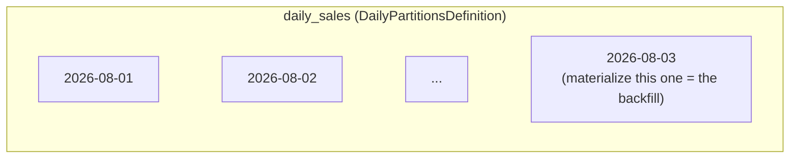

# daily_sales

[← Dagster](dagster.md) | [Home](../../../setup.md)

---

Dagster's actual answer to "backdated ingestion from a source system" — a `DailyPartitionsDefinition`-partitioned asset. Each calendar day is an independent partition; materializing an old one *is* the backfill, not a separate concept layered on top. Contrast with Airflow's [`example_backfill`](../airflow/example_backfill.md), which re-runs the whole DAG per missed day — see [`docs/12-orchestration.md`](../../12-orchestration.md) for the real distinction.

📍 `services/dagster/user-code/definitions.py:187` (`daily_partitions`) / `:190` (`daily_sales`)



## Try it

From the UI: open `daily_sales` → **Partitions** tab → pick a date (or a range) → **Materialize**. Via GraphQL, tag the run with the partition:

```bash
docker exec dagster-webserver dagster-graphql -r http://localhost:3000 -p launchPipelineExecution -v '{
  "executionParams": {
    "selector": {"repositoryLocationName": "user_code", "repositoryName": "__repository__", "pipelineName": "__ASSET_JOB", "assetSelection": [{"path": ["daily_sales"]}]},
    "mode": "default",
    "executionMetadata": {"tags": [{"key": "dagster/partition", "value": "2026-08-03"}]}
  }
}'
```

---

[← Dagster](dagster.md) | [Home](../../../setup.md)
