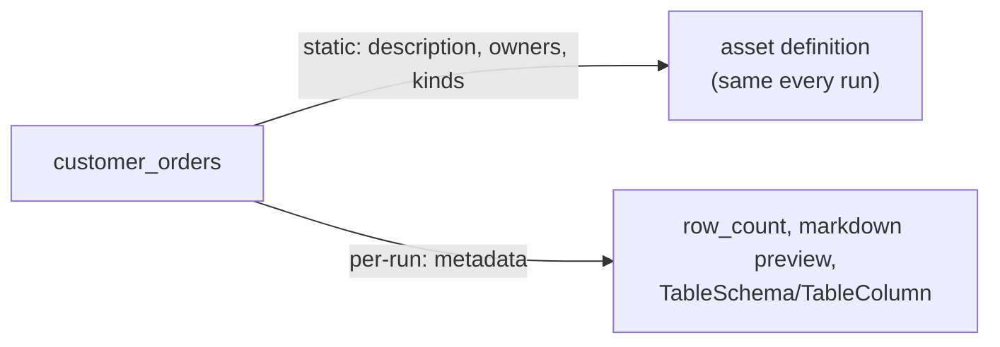

# customer_orders

[← Dagster](../dagster.md) | [Home](../../../../setup.md)

---

The "catalog" side of Dagster, none of the other assets here use any of it: `description`/`owners`/`kinds` set on the asset definition itself (fixed, shown on every run), plus per-materialization `metadata` computed fresh each time — a row count, a markdown preview table, and a real column-by-column schema via `TableSchema`/`TableColumn` that renders as an actual table on the asset's own UI page, not just prose. This is the difference between an asset graph and something that actually functions as documentation.

**Real-world problem:** a data analyst asks "does `orders` include cancelled orders, and can `amount` ever be null?" — and the only answer anyone can give is "let me go read the source code," because the pipeline's own UI shows a bare node with no description, no owner, and no schema.

📍 `services/dagster/user-code/definitions.py:251`



**Verified via GraphQL after materializing:** `description`/`kinds: ["postgres"]`/`owners: [{"team": "data-eng"}]` all present on the asset node, and the materialization's `metadataEntries` show `row_count: 3`, the rendered markdown preview, and all 4 columns (`order_id`/`customer_email`/`amount`/`status`) with their types and descriptions intact.

## Try it

```bash
docker exec dagster-webserver dagster-graphql -r http://localhost:3000 -p launchPipelineExecution -v '{
  "executionParams": {
    "selector": {"repositoryLocationName": "user_code", "repositoryName": "__repository__", "pipelineName": "__ASSET_JOB", "assetSelection": [{"path": ["customer_orders"]}]},
    "mode": "default"
  }
}'
```

---

[← Dagster](../dagster.md) | [Home](../../../../setup.md)
