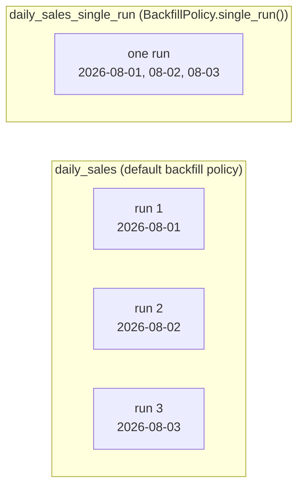

# daily_sales_single_run

[← Dagster](../dagster.md) | [Home](../../../../setup.md)

---

Same shape as [`daily_sales`](daily_sales.md), one crucial difference: `backfill_policy=BackfillPolicy.single_run()` means backfilling a *range* of partitions launches exactly one run (one step container) processing the whole range via `context.partition_keys` — not one run per partition the way `daily_sales`'s default backfill policy does. Real fit: a source system where fetching 5 days in one query is cheaper than 5 separate queries, or a downstream system that only accepts bulk writes.

Dagster itself flags `backfill_policy` as a **beta** parameter — stable enough to build on, same caveat as `docker_executor`/`DockerRunLauncher` (see `dagster.md`'s Notes).

📍 `services/dagster/user-code/definitions.py:264`



**A real gotcha hit building this**, worth knowing: the default filesystem IO manager can't persist one output covering multiple partitions ("does not support persisting an output associated with multiple partitions") — only one file path per partition. Dagster's own error message suggests the fix used here: return type `None` instead of the actual data (opt out of the IO manager entirely), or write a custom IO manager that does support multi-partition outputs for a real use case that needs the value persisted.

**Verified live:** backfilling the `2026-08-01`→`2026-08-03` range produced `STEP_WORKER_STARTED: 1` (one step container) with `ASSET_MATERIALIZATION: 3` (all 3 partitions recorded from that single step) — genuinely one run for the whole range, not three.

## Try it

```bash
docker exec dagster-webserver dagster-graphql -r http://localhost:3000 -p launchPipelineExecution -v '{
  "executionParams": {
    "selector": {"repositoryLocationName": "user_code", "repositoryName": "__repository__", "pipelineName": "__ASSET_JOB", "assetSelection": [{"path": ["daily_sales_single_run"]}]},
    "mode": "default",
    "executionMetadata": {"tags": [{"key": "dagster/asset_partition_range_start", "value": "2026-08-01"}, {"key": "dagster/asset_partition_range_end", "value": "2026-08-03"}]}
  }
}'
```

---

[← Dagster](../dagster.md) | [Home](../../../../setup.md)
