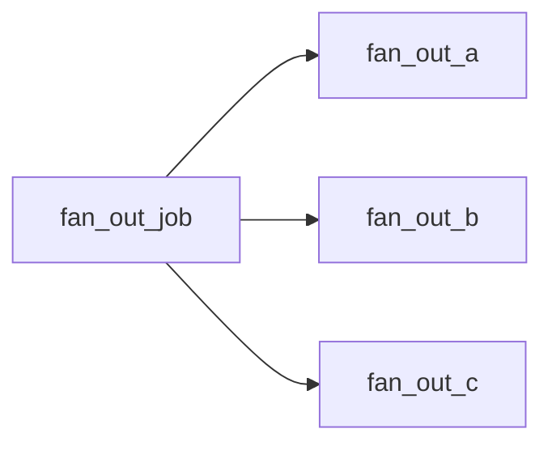

# fan_out_a / fan_out_b / fan_out_c

[← Dagster](../dagster.md) | [Home](../../../../setup.md)

---

3 independent assets, no shared dependency between them, each in its own step container — proof (not just an assumption) that Dagster materializes independent assets concurrently. The direct analog of Airflow's [`example_parallel_tasks`](../../airflow/examples/example_parallel_tasks.md) and Temporal's [`BatchProcessingWorkflow`](../../temporal/examples/BatchProcessingWorkflow.md) — see the [feature-parity table](../../../12-orchestration.md).

📍 `services/dagster/user-code/definitions.py:226` (`fan_out_a`) / `:231` (`fan_out_b`) / `:236` (`fan_out_c`)



**Verified via the run's own event log** (`event_logs` table, `dagster-db`): all 3 `STEP_START` events landed within 0.8s of each other, and each step's ~5s run window genuinely overlapped the others' — not three ~5s steps run back to back (which would show `STEP_START` events roughly 5s apart instead).

## Try it

```bash
docker exec dagster-webserver dagster-graphql -r http://localhost:3000 -p launchPipelineExecution -v '{
  "executionParams": {
    "selector": {"repositoryLocationName": "user_code", "repositoryName": "__repository__", "pipelineName": "fan_out_job"},
    "mode": "default"
  }
}'
```

---

[← Dagster](../dagster.md) | [Home](../../../../setup.md)
