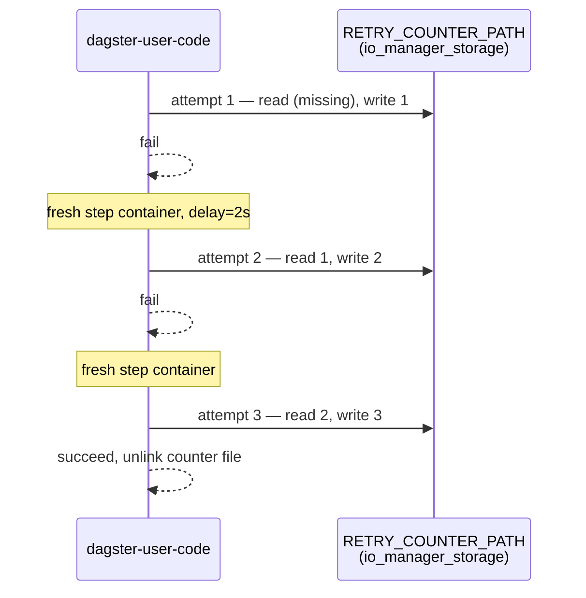

# flaky_retry_asset

[← Dagster](../dagster.md) | [Home](../../../../setup.md)

---

`retry_policy=RetryPolicy(max_retries=2, delay=2)` genuinely retrying, not just documented: the same "fails twice, succeeds on the third attempt" shape as Temporal's [`RetryableActivityWorkflow`](../../temporal/examples/RetryableActivityWorkflow.md) and Airflow's [`example_scheduled_with_retries`](../../airflow/examples/example_scheduled_with_retries.md) — see the [feature-parity table](../../../12-orchestration.md) for all three side by side.

**Real-world problem:** a pipeline step calls a third-party API that occasionally times out or hiccups for a second under load — a purely transient blip that would succeed if tried again a moment later. Without retries, that one flaky call fails the whole pipeline and pages someone at 2am for a problem that resolves itself in seconds.

The wrinkle unique to this one: every run — and every step within it — launches as its own container here, so a retry is a *fresh* step container, not a re-executed function in the same process. An in-memory attempt counter would reset to 0 every time; this persists the count to a file on `io_manager_storage` (the same shared volume every asset here already uses) instead — the same class of problem, and same kind of fix, as Airflow's [`example_stateful_retry`](../../airflow/examples/example_stateful_retry.md) using the Task State Store instead of a plain module-level dict.

📍 `services/dagster/user-code/definitions.py:162` (`RETRY_COUNTER_PATH`) / `:165` (`flaky_retry_asset`)



**Verified via the run's own event log** (`event_logs` table, `dagster-db`): `STEP_UP_FOR_RETRY: 2`, `STEP_RESTARTED: 2`, `STEP_WORKER_STARTED: 3` (three separate step containers), then `STEP_SUCCESS: 1`.

## Try it

```bash
docker exec dagster-webserver dagster-graphql -r http://localhost:3000 -p launchPipelineExecution -v '{
  "executionParams": {
    "selector": {"repositoryLocationName": "user_code", "repositoryName": "__repository__", "pipelineName": "__ASSET_JOB", "assetSelection": [{"path": ["flaky_retry_asset"]}]},
    "mode": "default"
  }
}'
```

---

[← Dagster](../dagster.md) | [Home](../../../../setup.md)
