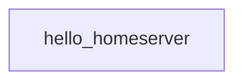

# hello_homeserver

[← Dagster](../dagster.md) | [Home](../../../../setup.md)

---

The simplest possible asset — one function, no dependencies, no config. Start here if you've never used Dagster before.

**Real-world problem:** you just stood up a new orchestrator and before writing any real pipeline code, you need to know the deployment itself actually works — the code location loads, the daemon can launch a run, materialization succeeds end to end — without any of your own business logic in the way to confuse "the platform is broken" with "my code is broken."

📍 `services/dagster/user-code/definitions.py:114`



## Try it

Select it in the UI's **Assets** tab → **Materialize selected**, or via GraphQL:

```bash
docker exec dagster-webserver dagster-graphql -r http://localhost:3000 -p launchPipelineExecution -v '{
  "executionParams": {
    "selector": {"repositoryLocationName": "user_code", "repositoryName": "__repository__", "pipelineName": "__ASSET_JOB", "assetSelection": [{"path": ["hello_homeserver"]}]},
    "mode": "default"
  }
}'
```

---

[← Dagster](../dagster.md) | [Home](../../../../setup.md)
