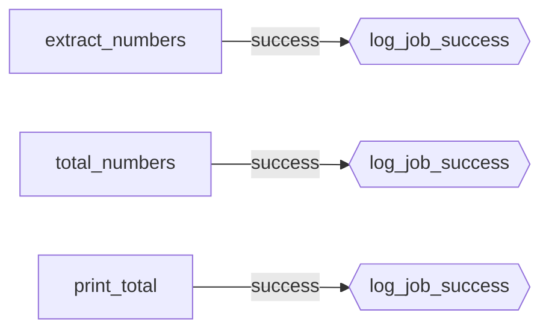

# log_job_success (a `@success_hook` on `ops_pipeline_job`)

[← Dagster](../dagster.md) | [Home](../../../../setup.md)

---

A `@success_hook`, Dagster's parallel to Airflow's `on_success_callback`/[custom `BaseNotifier`](../../airflow/examples/example_custom_notifier.md) — attached declaratively via `@job(hooks=...)` instead of passed as a callback argument. Fires once **per op**, not once per whole job — a real distinction worth knowing before assuming it behaves like a single job-level callback.

📍 `services/dagster/user-code/definitions.py:394` (`log_job_success`) / `:403` (`@job(hooks={log_job_success})`)



**Elsewhere in this stack:** Airflow's version fires at the *task* level (`on_success_callback`) or DAG level (`on_success_callback` on `@dag` itself, see `example_all_options`'s reference) — you pick which granularity per callback. Temporal doesn't need an equivalent at all: a workflow that wants to act on completion just does it in its own code (return value, or an Activity call in a `finally`/`except` block) — no separate hook-registration mechanism, since the workflow function itself already IS the orchestration logic.

**Verified live:** materializing `ops_pipeline_job` (3 ops: `extract_numbers` → `total_numbers` → `print_total`) produced `HOOK_COMPLETED: 3` in the run's event log — confirmed it fires per-op, not once for the whole job.

## Try it

```bash
docker exec dagster-webserver dagster-graphql -r http://localhost:3000 -p launchPipelineExecution -v '{
  "executionParams": {
    "selector": {"repositoryLocationName": "user_code", "repositoryName": "__repository__", "pipelineName": "ops_pipeline_job"},
    "mode": "default"
  }
}'
```

---

[← Dagster](../dagster.md) | [Home](../../../../setup.md)
