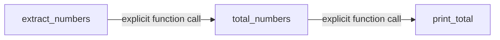

# ops_pipeline_job

[← Dagster](../dagster.md) | [Home](../../../../setup.md)

---

The classic `@op`/`@job` style, included deliberately next to the asset examples so the two are easy to compare — same 3-step shape as [`report_pipeline`](report_pipeline.md), but wired by explicit function calls (`print_total(total_numbers(extract_numbers()))`) instead of Dagster inferring an edge from a parameter name. Reach for this when a pipeline genuinely isn't shaped around producing/tracking data, or you're integrating code that's already op-shaped — see [`docs/12-orchestration.md`](../../../12-orchestration.md) for when ops fit better than assets.

**Real-world problem:** an existing batch script already runs as a sequence of side-effecting steps (send some emails, hit some webhooks, kick off an external process) — none of it "produces data" in a way that's natural to model as tracked assets. Forcing it into asset shape just to get it under Dagster would be artificial busywork with no real lineage benefit.

📍 `services/dagster/user-code/definitions.py:295` (`extract_numbers`) / `:303` (`total_numbers`) / `:308` (`print_total`) / `:313` (`ops_pipeline_job`)



## Try it

```bash
docker exec dagster-webserver dagster-graphql -r http://localhost:3000 -p launchPipelineExecution -v '{
  "executionParams": {
    "selector": {"repositoryLocationName": "user_code", "repositoryName": "__repository__", "pipelineName": "ops_pipeline_job"},
    "mode": "default"
  }
}'
```

---

[← Dagster](../dagster.md) | [Home](../../../../setup.md)
