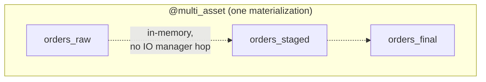

# orders_multi_asset

[← Dagster](../dagster.md) | [Home](../../../../setup.md)

---

`@multi_asset` — one function producing `orders_raw`/`orders_staged`/`orders_final` atomically in a single materialization, instead of three separate `@asset` functions. The point: all three share data in memory within one materialization (one source round-trip, no IO manager hop between them the way `cleaned_data` depends on `raw_data`'s output). A real fit for tightly-coupled steps: one API call that naturally yields a raw, a staged, and a validated view of the same batch.

**Real-world problem:** an upstream API is rate-limited or metered per call, and it returns everything you need (raw records, plus what a staging and validation pass would derive from them) in one response. Modeling raw/staged/final as three separate assets means either calling the API three times (burning quota) or bolting on an ad hoc caching layer just to avoid it.

📍 `services/dagster/user-code/definitions.py:239`



**Verified:** materializing selects all 3 asset keys in one `launchPipelineExecution` call and all 3 appear as separate nodes in the asset graph.

## Try it

```bash
docker exec dagster-webserver dagster-graphql -r http://localhost:3000 -p launchPipelineExecution -v '{
  "executionParams": {
    "selector": {"repositoryLocationName": "user_code", "repositoryName": "__repository__", "pipelineName": "__ASSET_JOB", "assetSelection": [{"path": ["orders_raw"]}, {"path": ["orders_staged"]}, {"path": ["orders_final"]}]},
    "mode": "default"
  }
}'
```

---

[← Dagster](../dagster.md) | [Home](../../../../setup.md)
