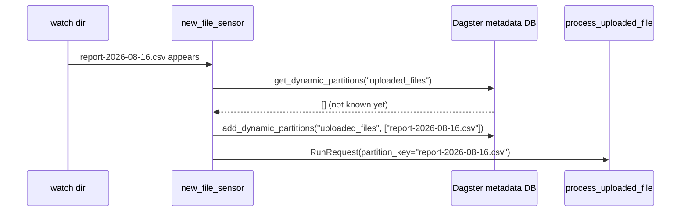

# process_uploaded_file / new_file_sensor

[← Dagster](../dagster.md) | [Home](../../../../setup.md)

---

A `DynamicPartitionsDefinition` — partitions created at **runtime**, by name, as files show up (tracked in Dagster's own metadata DB via `add_dynamic_partitions`), unlike [`daily_sales`](daily_sales.md)'s fixed `DailyPartitionsDefinition` where every partition (every calendar day) is known in advance. `new_file_sensor` watches a directory, and for each file not already a known partition, registers it as a brand-new partition key and requests a run for it — same self-contained marker-file pattern as [`marker_file_sensor`](marker_file_sensor.md), one level up (creating partitions, not just triggering a fixed job).

**Real-world problem:** people upload files to a shared folder whenever they have something new — there's no way to know ahead of time what those files will even be named next week. Anything that requires a full list decided in advance (like [`daily_sales`](daily_sales.md)'s fixed calendar of dates) simply doesn't work here; the only honest list is "whatever has actually shown up so far."

📍 `services/dagster/user-code/definitions.py:431` (`uploaded_files_partitions`) / `:435` (`process_uploaded_file`) / `:445` (`new_file_sensor`)



**Elsewhere in this stack:** Airflow's `.expand()`/`.partial()` ([`example_dynamic_task_mapping`](../../airflow/examples/example_dynamic_task_mapping.md)) is the closest analog — a variable number of units decided at run time — but the mapped task instances live only for that one DAG run and disappear after; a Dagster dynamic partition is durable and named, materializable again later by that same key. Temporal has no partition concept at all — the nearest equivalent shape is starting a new Workflow Execution per item (see [`BatchProcessingWorkflow`](../../temporal/examples/BatchProcessingWorkflow.md)'s child workflows), each with its own Workflow ID rather than a shared partition key.

**Verified live:** created `report-2026-08-16.csv` in the watched directory, started `new_file_sensor`; within one evaluation cycle the asset's `partitionKeys` genuinely included `report-2026-08-16.csv` (a key that didn't exist anywhere in this file beforehand), and the run it triggered materialized that exact partition.

## Try it

```bash
docker exec dagster-webserver dagster-graphql -r http://localhost:3000 -t 'mutation { startSensor(sensorSelector: {repositoryLocationName: "user_code", repositoryName: "__repository__", sensorName: "new_file_sensor"}) { ... on Sensor { sensorState { status } } } }'
docker exec dagster-user-code mkdir -p /tmp/io_manager_storage/.dynamic_partition_uploads
docker exec dagster-user-code touch /tmp/io_manager_storage/.dynamic_partition_uploads/report-2026-08-16.csv
# wait ~15s (minimum_interval_seconds), then:
docker exec dagster-webserver dagster-graphql -r http://localhost:3000 -t '{ assetNodeOrError(assetKey: {path: ["process_uploaded_file"]}) { ... on AssetNode { partitionKeys } } }'
```

---

[← Dagster](../dagster.md) | [Home](../../../../setup.md)
