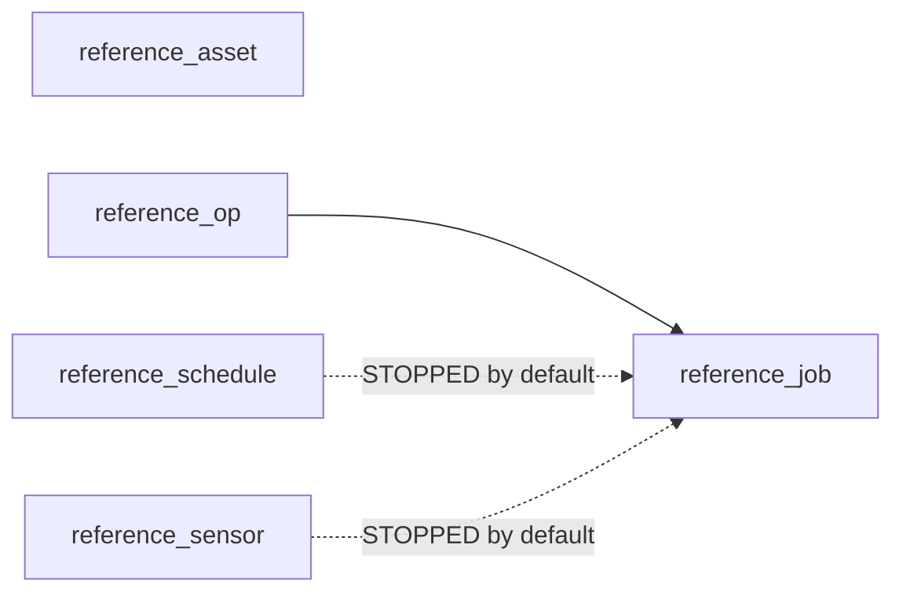

# reference_asset / reference_op / reference_job / reference_schedule / reference_sensor

[← Dagster](../dagster.md) | [Home](../../../../setup.md)

---

Reference, not a pattern demo like everything else in this doc: every `@asset`/`@op`/`@job`/`ScheduleDefinition`/`@sensor` option in one place, each shown at its real default with a one-line explanation (a checklist to copy from, not a live example of any one pattern). `reference_schedule`/`reference_sensor` both default to `DefaultScheduleStatus.STOPPED`/`DefaultSensorStatus.STOPPED` — Dagster's own real default, every schedule/sensor starts off — so registering them here has zero effect until you flip one on from its own tab.

**Real-world problem:** you know Dagster almost certainly has an option for what you need — a way to set an owner, a retry count, a concurrency pool — but can't remember the exact parameter name or its default without digging through source code or several doc pages. This page exists to be the one place to look instead.

📍 `services/dagster/user-code/definitions.py:342` (`reference_asset`) / `:378` (`reference_op`) / `:397` (`reference_job`) / `:419` (`reference_schedule`) / `:443` (`reference_sensor`)



**Verified:** `reference_job` shows up in the repository's job list, and materializing `reference_asset` completes with `SUCCESS`.

## Try it

```bash
docker exec dagster-webserver dagster-graphql -r http://localhost:3000 -p launchPipelineExecution -v '{
  "executionParams": {
    "selector": {"repositoryLocationName": "user_code", "repositoryName": "__repository__", "pipelineName": "__ASSET_JOB", "assetSelection": [{"path": ["reference_asset"]}]},
    "mode": "default"
  }
}'
```

---

[← Dagster](../dagster.md) | [Home](../../../../setup.md)
