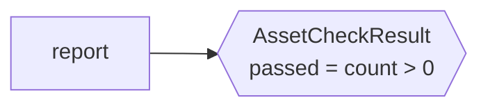

# report_freshness_check

[← Dagster](../dagster.md) | [Home](../../../../setup.md)

---

An **Asset Check** — Dagster's built-in data-quality concept (a pass/fail validation attached to a specific asset, shown right on that asset's page). Neither Airflow nor Temporal have a native equivalent — see the [feature-parity table](../../../12-orchestration.md); you'd hand-roll the same idea as a plain extra task/activity.

**Real-world problem:** an upstream data source silently returns zero rows one day (an API outage, an empty export) — the pipeline "succeeds" because no exception was thrown, and an empty or broken report goes out to stakeholders before anyone notices something was actually wrong.

📍 `services/dagster/user-code/definitions.py:141`

## Try it

Materializing [`report_pipeline`](report_pipeline.md) runs this check automatically — see its own page for the checks tab result, or select `report` + its checks in the UI's **Assets** tab.

---

[← Dagster](../dagster.md) | [Home](../../../../setup.md)
