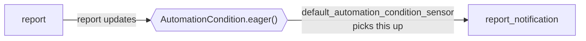

# report_notification

[← Dagster](../dagster.md) | [Home](../../../../setup.md)

---

A third scheduling paradigm, alongside the explicit Schedule ([`report_pipeline`](report_pipeline.md)) and the explicit Sensor ([`marker_file_sensor`](marker_file_sensor.md)): **Declarative Automation**. Instead of either, it declares `automation_condition=AutomationCondition.eager()` — "materialize me whenever `report` updates" — and `dagster-daemon`'s built-in `default_automation_condition_sensor` handles the rest, no schedule or sensor function of your own.

📍 `services/dagster/user-code/definitions.py:149`



That sensor is off by default like any other sensor; turn it on from the **Sensors** tab, then materialize `report_job` and watch `report_notification` appear on its own shortly after.

**Verified:** it auto-materialized ~28s after `report`'s own materialization, with no manual trigger.

## Try it

```bash
docker exec dagster-webserver dagster-graphql -r http://localhost:3000 -t 'mutation { startSensor(sensorSelector: {repositoryLocationName: "user_code", repositoryName: "__repository__", sensorName: "default_automation_condition_sensor"}) { ... on Sensor { sensorState { status } } } }'
```

---

[← Dagster](../dagster.md) | [Home](../../../../setup.md)
