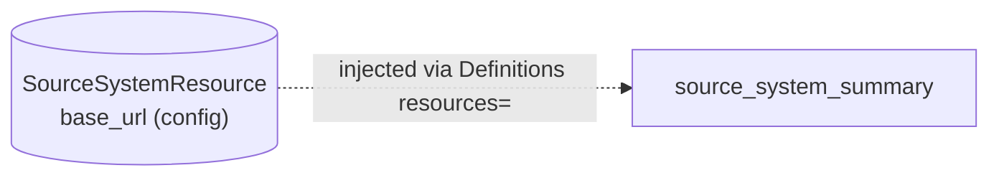

# source_system_summary

[← Dagster](../dagster.md) | [Home](../../../../setup.md)

---

Uses a **Resource** (`SourceSystemResource`) — how an asset gets a configurable connection to something external (an API base URL, credentials) instead of hardcoding a client inline. The asset's `source_system: SourceSystemResource` parameter is a giveaway that it's a dependency injection, not a lineage edge — Dagster checks the `Definitions(resources=...)` dict for a matching key first, *then* falls back to treating the parameter as another asset.

**Real-world problem:** the same pipeline needs to run against a staging API in dev and the real production API in prod — with the base URL and credentials hardcoded inside the asset function itself, promoting code from dev to prod means editing and re-deploying source code, instead of just changing which config value gets passed in.

📍 `services/dagster/user-code/definitions.py:208` (`SourceSystemResource`) / `:221` (`source_system_summary`)



Swapping environments means changing the `SourceSystemResource(...)` value passed into `Definitions`, not the asset's code.

## Try it

```bash
docker exec dagster-webserver dagster-graphql -r http://localhost:3000 -p launchPipelineExecution -v '{
  "executionParams": {
    "selector": {"repositoryLocationName": "user_code", "repositoryName": "__repository__", "pipelineName": "__ASSET_JOB", "assetSelection": [{"path": ["source_system_summary"]}]},
    "mode": "default"
  }
}'
```

---

[← Dagster](../dagster.md) | [Home](../../../../setup.md)
